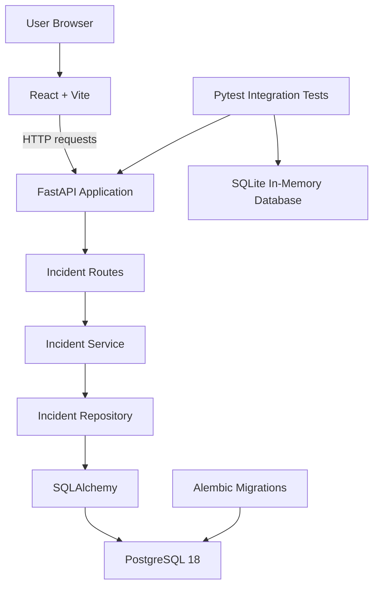

# Cloud Operations Platform Architecture

## Overview

The Cloud Operations Platform uses a client-server architecture composed of a React single-page application, a FastAPI REST API, and a PostgreSQL database.

Phase 2 introduces persistent incident management, SQLAlchemy models, Alembic migrations, environment-based database configuration, and a layered backend design.

## Current Architecture



## Components

| Component | Responsibility |
|---|---|
| React frontend | Presents the user interface and displays backend availability |
| Vite | Runs the frontend development server and creates production builds |
| FastAPI application | Configures middleware, health endpoints, and API routers |
| Incident routes | Translate HTTP requests and responses for Incident operations |
| Incident service | Coordinates business logic and database transactions |
| Incident repository | Performs SQLAlchemy persistence operations |
| Pydantic schemas | Validate request bodies and serialize API responses |
| SQLAlchemy models | Define database tables, columns, indexes, and constraints |
| PostgreSQL | Persists application data during local development |
| Alembic | Versions and applies database schema changes |
| Pytest | Executes automated health and Incident API tests |
| SQLite | Provides an isolated in-memory database during tests |

## Backend Layered Design

The backend separates responsibilities into focused packages:

```text
backend/app/
|-- api/
|   `-- routes/
|       `-- incidents.py
|-- core/
|   `-- config.py
|-- db/
|   |-- base.py
|   `-- session.py
|-- models/
|   `-- incident.py
|-- repositories/
|   `-- incidents.py
|-- schemas/
|   `-- incident.py
|-- services/
|   `-- incidents.py
`-- main.py
```

| Layer | Responsibility |
|---|---|
| API route | Receives HTTP input and converts domain errors into HTTP responses |
| Schema | Validates incoming data and controls response serialization |
| Service | Applies application logic and owns commit or rollback behavior |
| Repository | Reads and modifies persistent records through SQLAlchemy |
| Model | Defines the database representation of an Incident |
| Database session | Provides one SQLAlchemy session per API request |
| Core configuration | Loads environment-specific settings from `.env` |

## Incident Request Flow

A successful create request follows this sequence:

1. The client sends `POST /api/incidents`.
2. FastAPI validates the JSON body using `IncidentCreate`.
3. The route passes validated data to the Incident service.
4. The service calls the Incident repository.
5. The repository creates the SQLAlchemy model and flushes it.
6. The service commits the database transaction.
7. FastAPI serializes the model using `IncidentResponse`.
8. The client receives `201 Created`.

Retrieve, update, and delete requests use a UUID path parameter. The service raises `IncidentNotFoundError` when the requested record does not exist, and the API route converts the error into `404 Not Found`.

## Transaction Management

Repository functions stage database operations with `flush()` but do not finalize transactions.

The service layer controls transaction boundaries:

- Successful create, update, and delete operations call `commit()`.
- Failed persistence operations call `rollback()`.
- Read operations do not create explicit commits.
- FastAPI closes the request session through the `get_db` dependency.

This separation keeps transaction behavior outside HTTP routing and low-level repository code.

## Incident Data Model

The `incidents` table stores operational events.

| Column | Database Type | Rules |
|---|---|---|
| `id` | UUID | Primary key generated by the application |
| `title` | VARCHAR(200) | Required and indexed |
| `description` | TEXT | Required |
| `service_name` | VARCHAR(120) | Required and indexed |
| `severity` | VARCHAR(8) | Required, defaults to `medium` |
| `status` | VARCHAR(13) | Required, defaults to `open`, indexed |
| `created_at` | TIMESTAMP WITH TIME ZONE | Required and generated automatically |
| `updated_at` | TIMESTAMP WITH TIME ZONE | Required and updated automatically |

Supported severity values:

```text
low
medium
high
critical
```

Supported status values:

```text
open
investigating
resolved
closed
```

PostgreSQL enforces these values through the named CHECK constraints:

```text
incident_severity
incident_status
```

## Database Indexes

The Incident table includes the following indexes:

| Index | Purpose |
|---|---|
| `pk_incidents` | Provides unique UUID lookup |
| `ix_incidents_title` | Supports future title searches |
| `ix_incidents_service_name` | Supports filtering by affected service |
| `ix_incidents_status` | Supports filtering by lifecycle status |

## Migration Strategy

Alembic reads the database URL from application settings and uses `Base.metadata` to discover SQLAlchemy models.

The first migration creates:

- The `incidents` table
- UUID primary key
- Severity and status CHECK constraints
- Service name, status, and title indexes
- Creation and update timestamps

The PostgreSQL database stores its current revision in the `alembic_version` table.

Schema changes follow this workflow:

1. Update the SQLAlchemy model.
2. Generate an Alembic revision with `--autogenerate`.
3. Review the generated migration.
4. Apply the migration with `alembic upgrade head`.
5. Verify schema consistency with `alembic check`.

## Frontend Design

The frontend currently focuses on backend health visibility.

| File | Responsibility |
|---|---|
| `src/main.jsx` | Creates the React root and renders the application |
| `src/App.jsx` | Requests backend health and displays connection status |
| `src/index.css` | Defines global layout and visual styling |

The frontend reads the backend URL from:

```text
VITE_API_BASE_URL
```

When the variable is unavailable, it uses:

```text
http://127.0.0.1:8000
```

Incident management screens will be added in later frontend phases.

## Local Ports

| Service | Local Port | Container Port |
|---|---:|---:|
| React development server | 5173 | Not containerized |
| FastAPI backend | 8000 | Not containerized |
| PostgreSQL | 5434 | 5432 |

Port 5434 avoids conflicts with a default local PostgreSQL installation and other portfolio databases.

## Configuration and Security

Application configuration is defined in `.env.example`.

The private `.env` file is excluded through `.gitignore` and must not be committed. It contains local database credentials and environment-specific connection information.

SQLAlchemy masks passwords when connection URLs are rendered for diagnostics.

CORS currently permits only the local React development origins:

```text
http://127.0.0.1:5173
http://localhost:5173
```

Production credentials, origins, and database URLs will be supplied through the cloud deployment environment.

## Testing Strategy

The automated backend suite currently contains five tests:

- Health endpoint response
- Local frontend CORS access
- Complete Incident CRUD lifecycle
- Missing Incident response
- Invalid request and pagination validation

Tests replace the production database dependency with an isolated SQLite in-memory database.

`StaticPool` keeps the in-memory database available across FastAPI test threads, while an automatic fixture creates and removes the schema around every test.

This design provides:

- Fast test execution
- Repeatable test state
- No dependency on Docker during unit and API integration tests
- No test data written to the PostgreSQL development database

PostgreSQL behavior is additionally verified through Alembic schema checks and a manual live API smoke test.

## Implemented Phases

| Phase | Architecture Addition | Status |
|---|---|---|
| 1 | React frontend, FastAPI backend, health integration, and CORS | Complete |
| 2 | PostgreSQL, SQLAlchemy, Alembic, layered Incident CRUD, and integration tests | Complete |

## Planned Architecture Evolution

| Phase | Architecture Addition |
|---|---|
| 3 | Authentication, authorization, password security, and protected routes |
| 4 | React routing, reusable components, and application state |
| 5 | Incident management interface and advanced workflow rules |
| 6 | Dashboard queries, filtering, metrics, and audit history |
| 7 | Backend and frontend containers with Docker Compose networking |
| 8 | Automated validation and deployment workflows through GitHub Actions |
| 9 | Cloud hosting, production configuration, logging, and monitoring |
