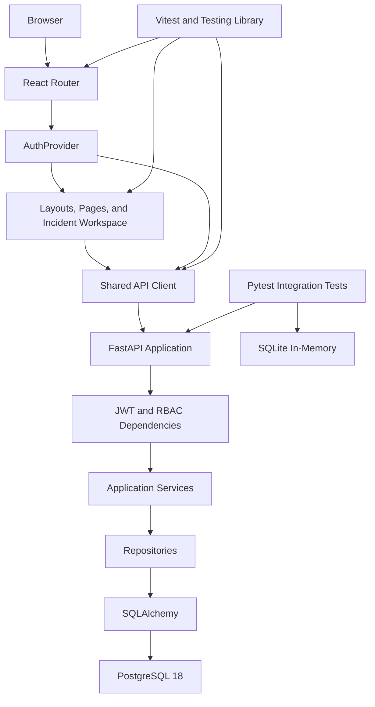
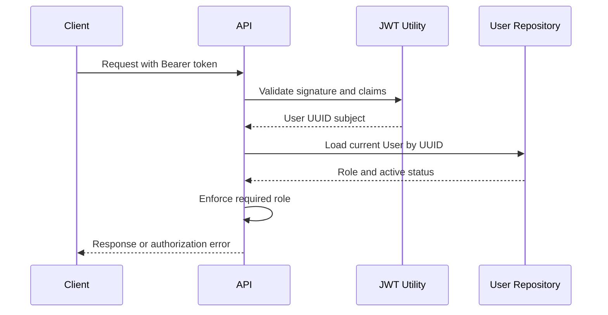
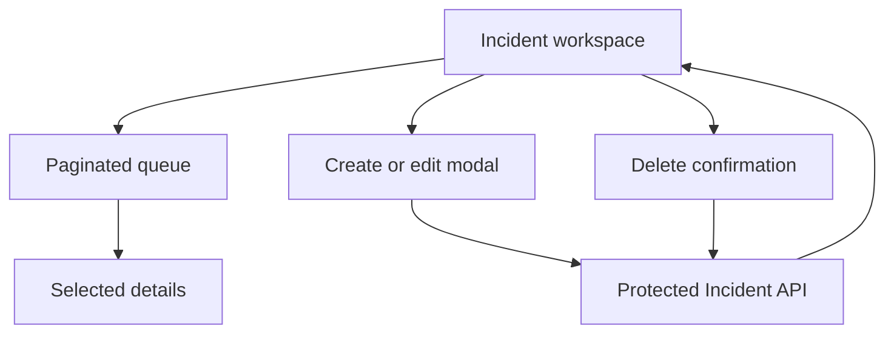
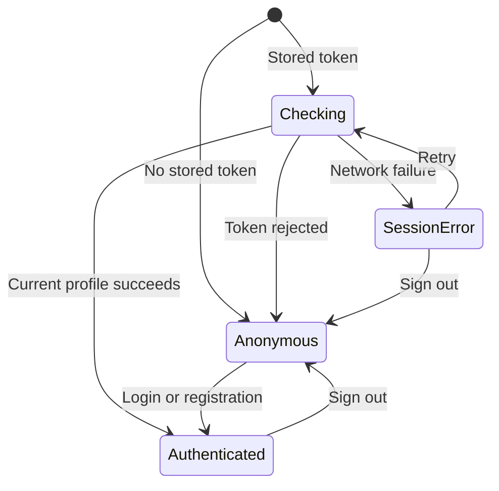

# Cloud Operations Platform Architecture

## Overview

The Cloud Operations Platform uses a client-server architecture composed of a React single-page application, a FastAPI REST API, and a PostgreSQL database.

Phase 5 completes the frontend Incident-management workflow. Authenticated users can browse paginated Incidents and inspect details, operators can create and update records, and administrators can additionally perform confirmed deletion. The interface includes reusable forms, status and severity presentation, mutation feedback, empty states, recoverable errors, and automated workflow tests.

The FastAPI backend remains the authoritative security boundary. Frontend route and role checks control presentation and navigation, while every protected API request independently validates the JWT, current account status, and required database-backed role.

## Current Architecture



## Components

| Component | Responsibility |
|---|---|
| React frontend | Presents responsive public and authenticated user interfaces |
| React Router | Defines public, protected, role-restricted, and fallback routes |
| AuthProvider | Restores sessions and exposes authentication state and actions |
| Token storage | Persists the JWT for the lifetime of the current browser tab |
| Route guards | Control access to signed-out, authenticated, and role-specific pages |
| Authentication layout | Presents shared branding around registration and login forms |
| Application layout | Presents authenticated navigation, role details, and page content |
| Dashboard | Displays backend availability and the current user's access level |
| Incident workspace | Coordinates paginated loading, selection, mutations, and feedback |
| Incident API module | Maps frontend form data to protected Incident CRUD requests |
| Incident presentation components | Render the queue, selected details, severity, and lifecycle status |
| Incident form | Supports role-authorized creation and editing |
| Modal and delete dialog | Present focused editing and confirmed destructive actions |
| Shared API client | Sends API requests and normalizes backend and network errors |
| Vite | Runs the frontend development server and creates production builds |
| Vitest | Executes frontend unit, API, route, and workflow tests |
| React Testing Library | Tests rendered components through user-visible behavior |
| jsdom | Provides the simulated browser environment for frontend tests |
| FastAPI application | Configures middleware, public endpoints, and API routers |
| Authentication routes | Register users, authenticate credentials, and return the current profile |
| Authentication dependencies | Validate bearer tokens and load the current database user |
| User routes | Provide administrator-only user and role management |
| Incident routes | Enforce role permissions and translate Incident HTTP requests |
| Security utilities | Hash passwords and create or validate JWT access tokens |
| Services | Apply business rules and control transaction boundaries |
| Repositories | Stage SQLAlchemy reads and writes without committing |
| Pydantic schemas | Validate requests and control response serialization |
| SQLAlchemy models | Define User and Incident database structures |
| PostgreSQL | Persist development users and Incidents |
| Alembic | Version and apply database schema changes |
| Pytest | Execute backend authentication, authorization, health, and Incident tests |
| SQLite | Provide a disposable in-memory backend test database |

## Backend Layered Design

```text
backend/app/
|-- api/
|   |-- dependencies/
|   |   `-- auth.py
|   `-- routes/
|       |-- auth.py
|       |-- incidents.py
|       `-- users.py
|-- cli/
|   `-- bootstrap_admin.py
|-- core/
|   |-- config.py
|   `-- security.py
|-- db/
|   |-- base.py
|   `-- session.py
|-- models/
|   |-- incident.py
|   `-- user.py
|-- repositories/
|   |-- incidents.py
|   `-- users.py
|-- schemas/
|   |-- incident.py
|   `-- user.py
|-- services/
|   |-- auth.py
|   `-- incidents.py
`-- main.py
```

| Layer | Responsibility |
|---|---|
| API route | Receives HTTP input and converts service errors into HTTP responses |
| Dependency | Resolves database sessions, bearer tokens, current users, and roles |
| Schema | Validates incoming data and controls public response fields |
| Service | Applies business rules and owns commit or rollback behavior |
| Repository | Reads records and stages database changes with `flush()` |
| Model | Defines persistent User and Incident representations |
| Database session | Provides one SQLAlchemy session per API request |
| Core configuration | Loads database and JWT settings from environment variables |
| Security utility | Performs Argon2 and JWT cryptographic operations |
| CLI command | Creates or promotes the first administrator securely |

## Authentication Design

### Registration

A successful registration follows this flow:

1. The client sends `POST /api/auth/register` with email, full name, and password.
2. Pydantic validates the email and password length.
3. The service normalizes the email to lowercase.
4. The service checks whether the normalized email already exists.
5. The password is hashed with Argon2.
6. The repository stages the User record.
7. The service commits the transaction.
8. FastAPI serializes the record using `UserResponse`.
9. The password and password hash are excluded from the response.

Public registration always assigns the `viewer` role. Clients cannot select `operator` or `admin` during registration.

### Login

A successful login follows this flow:

1. The client submits email and password to `POST /api/auth/token`.
2. The endpoint receives OAuth2-compatible form data.
3. The service looks up the normalized email.
4. The supplied password is verified against the Argon2 hash.
5. Disabled accounts are rejected.
6. The security utility creates a signed access token.
7. The API returns the bearer token and its lifetime.

Incorrect emails and passwords produce the same public error message. Authentication for an unknown email still performs password-hash verification to reduce observable timing differences.

### Authenticated Request



Every authenticated request reloads the User from the database.

This design means:

- Role changes apply to existing tokens immediately.
- Disabled accounts lose access immediately.
- Deleted users cannot continue using previously issued tokens.
- Authorization does not depend on a role claim stored in an older token.

## JWT Design

Access tokens contain:

| Claim | Purpose |
|---|---|
| `sub` | Stores the User UUID as the token subject |
| `type` | Identifies the token as an access token |
| `iat` | Records when the token was issued |
| `exp` | Rejects the token after its configured lifetime |
| `iss` | Identifies the Cloud Operations API as issuer |
| `aud` | Restricts the intended token consumer |

JWT validation:

- Accepts only the configured `HS256` algorithm
- Verifies the signature
- Verifies expiration
- Verifies issuer
- Verifies audience
- Requires an access-token type
- Requires a non-empty subject
- Requires the subject to be a valid User UUID

The JWT does not contain the User role.

## Role-Based Access Control

The application defines three roles:

| Role | Responsibility |
|---|---|
| `viewer` | Read operational Incident information |
| `operator` | Read, create, and update Incidents |
| `admin` | Perform all Incident operations and manage users |

The enforced permission matrix is:

| Operation | Viewer | Operator | Admin |
|---|---:|---:|---:|
| List incidents | Yes | Yes | Yes |
| Retrieve an incident | Yes | Yes | Yes |
| Create an incident | No | Yes | Yes |
| Update an incident | No | Yes | Yes |
| Delete an incident | No | No | Yes |
| List users | No | No | Yes |
| Retrieve a user | No | No | Yes |
| Change user roles | No | No | Yes |
| Activate or disable users | No | No | Yes |

Administrator routes prevent the current administrator from:

- Removing their own administrator role
- Disabling their own account

This avoids accidental self-lockout through the API.

## Administrator Bootstrap

A new environment initially has no administrator.

The `app.cli.bootstrap_admin` command provides a controlled bootstrap path:

1. It searches for the normalized email.
2. If the User exists, it promotes the account to `admin`.
3. If the User does not exist, it securely prompts for a password.
4. It validates the new User through the same Pydantic schema.
5. It creates the User through the same service and repository layers.
6. It assigns the administrator role.
7. It reactivates the account when necessary.

The password is not accepted as a command-line argument, preventing it from being stored in shell history.

The command is idempotent and handles `Ctrl + C` without displaying a traceback.

## Transaction Management

Repositories stage database changes with `flush()` and do not finalize transactions.

Services control transaction boundaries:

- Successful User and Incident writes call `commit()`.
- Failed writes call `rollback()`.
- Read operations do not create explicit commits.
- Duplicate registration handles database uniqueness races and rolls back the session.
- FastAPI closes each request session through the `get_db` dependency.

This keeps transaction ownership out of HTTP routes and low-level repositories.

## User Data Model

The `users` table stores authenticated accounts.

| Column | Database Type | Rules |
|---|---|---|
| `id` | UUID | Primary key generated by the application |
| `email` | VARCHAR(320) | Required, normalized, and uniquely indexed |
| `full_name` | VARCHAR(120) | Required |
| `password_hash` | VARCHAR(255) | Required Argon2 hash |
| `role` | VARCHAR(8) | Required and defaults to `viewer` |
| `is_active` | BOOLEAN | Required and defaults to true |
| `created_at` | TIMESTAMP WITH TIME ZONE | Generated automatically |
| `updated_at` | TIMESTAMP WITH TIME ZONE | Updated automatically |

Supported role values:

```text
viewer
operator
admin
```

PostgreSQL enforces the values with the `user_role` CHECK constraint.

User indexes:

| Index | Purpose |
|---|---|
| `pk_users` | Provides unique UUID lookup |
| `ix_users_email` | Enforces unique email addresses and supports login lookup |
| `ix_users_role` | Supports role-based administration queries |
| `ix_users_is_active` | Supports account-status queries |

## Incident Data Model

The `incidents` table stores operational events.

| Column | Database Type | Rules |
|---|---|---|
| `id` | UUID | Primary key generated by the application |
| `title` | VARCHAR(200) | Required and indexed |
| `description` | TEXT | Required |
| `service_name` | VARCHAR(120) | Required and indexed |
| `severity` | VARCHAR(8) | Required and defaults to `medium` |
| `status` | VARCHAR(13) | Required, defaults to `open`, and is indexed |
| `created_at` | TIMESTAMP WITH TIME ZONE | Generated automatically |
| `updated_at` | TIMESTAMP WITH TIME ZONE | Updated automatically |

Supported severity values:

```text
low
medium
high
critical
```

Supported status values:

```text
open
investigating
resolved
closed
```

PostgreSQL enforces these values through:

```text
incident_severity
incident_status
```

Incident indexes:

| Index | Purpose |
|---|---|
| `pk_incidents` | Provides unique UUID lookup |
| `ix_incidents_title` | Supports future title searches |
| `ix_incidents_service_name` | Supports affected-service filtering |
| `ix_incidents_status` | Supports lifecycle-status filtering |

## Migration Strategy

Alembic reads the database URL from application settings and discovers models through `Base.metadata`.

Current migration history:

| Revision | Change |
|---|---|
| `2ef9cb82e708` | Creates the Incident table, constraints, and indexes |
| `6b0140f7a01f` | Creates the User table, role constraint, and indexes |

Schema changes follow this workflow:

1. Update a SQLAlchemy model.
2. Generate an Alembic revision with `--autogenerate`.
3. Review the generated migration.
4. Apply the migration with `alembic upgrade head`.
5. Verify schema consistency with `alembic check`.

## Configuration and Security

Application configuration is documented in `.env.example`.

The private `.env` file is excluded through `.gitignore`. It contains:

- Local PostgreSQL credentials
- SQLAlchemy database URL
- JWT signing secret
- Token algorithm and lifetime
- Token issuer and audience
- Frontend backend-API address

The JWT secret is represented by Pydantic `SecretStr` to reduce accidental logging.

Backend controls include:

- Argon2 password hashing
- Minimum password length validation
- Normalized email uniqueness
- Generic incorrect-credentials responses
- Fixed JWT algorithm allowlist
- Expiration, issuer, and audience validation
- Database-backed roles and account status
- Public-registration role restriction
- Administrator self-lockout prevention
- Isolated test credentials

Frontend controls include:

- Session-scoped token storage
- Stored-token verification through `/api/auth/me`
- Rejected-token removal after `401` or `403`
- Safe internal return-path validation after login
- Public-only and authenticated route guards
- Administrator-only route presentation
- Structured API and network error handling
- Role-aware Incident mutation controls
- Explicit confirmation before administrator deletion

Frontend route restrictions do not replace backend authorization. Direct API requests are independently checked by FastAPI.

CORS currently permits only:

- `http://127.0.0.1:5173`
- `http://localhost:5173`

Production secrets, origins, and database URLs will be supplied through the deployment environment. Production deployment should also enforce HTTPS and a restrictive Content Security Policy.

## Testing Strategy

### Backend Validation

The backend suite contains 18 automated integration tests covering:

- Health endpoint behavior
- Local frontend CORS access
- User registration
- Email normalization and duplicate detection
- Argon2 password storage and verification
- OAuth2 login
- JWT authentication
- Missing and malformed tokens
- Disabled accounts
- Viewer Incident permissions
- Operator Incident permissions
- Administrator Incident permissions
- Administrator user management
- Immediate role and status enforcement
- Privilege-escalation prevention
- Administrator self-lockout prevention
- Incident validation and pagination
- Missing User and Incident responses

Tests replace the PostgreSQL dependency with SQLite in-memory storage.

`StaticPool` keeps the database available across FastAPI test threads, while fixtures create and remove the schema around each test.

PostgreSQL-specific behavior is additionally verified with:

- Alembic migration execution
- `alembic check`
- Live registration and login
- Live role changes
- Live administrator access

### Frontend Validation

The frontend suite contains 23 automated tests across five test files.

Vitest uses jsdom as its browser environment. React Testing Library and User Event exercise rendered behavior through accessible controls, while Jest DOM provides browser-focused assertions.

Frontend coverage includes:

- Empty token-storage state
- Saving, restoring, and removing an access token
- Public-only route behavior
- Signed-out protected-route redirects
- Authenticated route rendering
- Role-restricted route redirects
- Registration request normalization
- OAuth2 login-form construction
- Current-user bearer authorization
- Backend authentication error propagation
- Incident list, detail, create, update, and delete requests
- Incident query-string pagination
- Incident payload trimming and field-name mapping
- Viewer read-only Incident presentation
- Operator creation and editing workflows
- Administrator confirmed deletion
- Recoverable Incident-list failures
- Forward and backward Incident-page navigation
- Shared mock and DOM cleanup between cases

Incident workflow tests mock the browser `fetch` boundary. They verify UI-to-API behavior without modifying PostgreSQL development data.

The Vite production build additionally validates imports, JSX transformation, CSS processing, and optimized bundle generation.

Together, the backend and frontend suites provide 41 automated tests with:

- Repeatable isolated state
- HTTP-level authentication and authorization coverage
- Frontend session, navigation, and Incident workflow coverage
- No automated test records written to PostgreSQL
- Reproducible local validation before commit

## Frontend Design

The frontend separates backend communication, authentication state, routing, reusable presentation, layouts, and page-level workflow coordination.

| Area | Responsibility |
|---|---|
| `src/main.jsx` | Creates the React root and installs `BrowserRouter` and `AuthProvider` |
| `src/App.jsx` | Defines public, protected, administrator, and fallback routes |
| `src/api/client.js` | Sends shared API requests and normalizes unsuccessful responses |
| `src/api/auth.js` | Registers users, requests tokens, and loads the current profile |
| `src/api/auth.test.js` | Verifies authentication request construction and errors |
| `src/api/health.js` | Requests backend health information |
| `src/api/incidents.js` | Sends authenticated Incident CRUD and pagination requests |
| `src/api/incidents.test.js` | Verifies Incident URLs, payload mapping, authorization, and responses |
| `src/auth/AuthContext.jsx` | Owns session restoration, login, registration, logout, and retry actions |
| `src/auth/token-storage.js` | Reads, writes, and removes the session-scoped access token |
| `src/routes/ProtectedRoute.jsx` | Requires authentication and optional roles |
| `src/routes/PublicOnlyRoute.jsx` | Redirects authenticated users away from public authentication pages |
| `src/layouts/AuthLayout.jsx` | Presents shared registration and login branding |
| `src/layouts/AppLayout.jsx` | Presents role-aware navigation and the authenticated workspace |
| `src/components/RouteStatus.jsx` | Displays session loading and recoverable connection states |
| `src/components/PageHeader.jsx` | Provides consistent authenticated page headings |
| `src/components/IncidentList.jsx` | Renders selectable paginated Incident summaries |
| `src/components/IncidentDetails.jsx` | Displays the selected Incident and permitted actions |
| `src/components/IncidentForm.jsx` | Collects validated creation and editing fields |
| `src/components/Modal.jsx` | Provides the shared accessible overlay container |
| `src/components/IncidentDeleteDialog.jsx` | Requires explicit confirmation before deletion |
| `src/pages/LoginPage.jsx` | Authenticates an existing user |
| `src/pages/RegisterPage.jsx` | Creates and authenticates a viewer account |
| `src/pages/DashboardPage.jsx` | Displays backend health and current-role information |
| `src/pages/IncidentsPage.jsx` | Coordinates Incident loading, pagination, selection, and mutations |
| `src/pages/IncidentsPage.test.jsx` | Verifies role-aware Incident workflows and failure recovery |
| `src/pages/UsersPage.jsx` | Provides the administrator workspace placeholder |
| `src/pages/ForbiddenPage.jsx` | Explains insufficient route access |
| `src/pages/NotFoundPage.jsx` | Handles unmatched frontend locations |
| `src/index.css` | Defines responsive authentication, application, Incident, form, and modal styling |
| `src/test/setup.js` | Installs frontend assertions and resets test state |

### Incident Workspace Flow



| Role | Read and paginate | Create | Edit | Delete |
|---|---:|---:|---:|---:|
| Viewer | Yes | No | No | No |
| Operator | Yes | Yes | Yes | No |
| Administrator | Yes | Yes | Yes | Yes |

`IncidentsPage` owns request state and selected-record state. A successful creation returns the workspace to the first page, an update replaces the matching list and detail records, and deletion reloads the active page. If deletion empties a later page, navigation returns to the preceding page.

Loading, empty, error, success, and busy states are rendered explicitly. Recoverable list failures expose a retry action, mutation errors remain with their active form or confirmation dialog, and the backend independently rejects unauthorized requests.

### Session State



The frontend does not treat possession of a token as proof of authentication. A stored token must successfully load the current database-backed profile before protected content is rendered.

### Route Structure

| Route | Guard | Layout |
|---|---|---|
| `/login` | Public only | Authentication layout |
| `/register` | Public only | Authentication layout |
| `/dashboard` | Authenticated | Application layout |
| `/incidents` | Authenticated | Application layout |
| `/users` | Administrator | Application layout |
| `/forbidden` | Authenticated | Application layout |
| Unmatched route | None | Not-found page |

The responsive application layout uses a persistent sidebar on larger screens and adapts navigation, forms, dialogs, and the Incident workspace for smaller displays.

## Local Ports

| Service | Local Port | Container Port |
|---|---:|---:|
| React development server | 5173 | Not containerized |
| FastAPI backend | 8000 | Not containerized |
| PostgreSQL | 5434 | 5432 |

Port 5434 avoids conflicts with default PostgreSQL installations and other portfolio databases.

## Implemented Phases

| Phase | Architecture Addition | Status |
|---|---|---|
| 1 | React frontend, FastAPI backend, health integration, and CORS | Complete |
| 2 | PostgreSQL, SQLAlchemy, Alembic, layered Incident CRUD, and tests | Complete |
| 3 | Argon2, JWT authentication, database-backed RBAC, and protected APIs | Complete |
| 4 | React Router, shared API clients, authentication state, protected routes, responsive layouts, and frontend tests | Complete |
| 5 | Role-aware Incident queue, details, CRUD modals, pagination, request states, and workflow tests | Complete |

## Planned Architecture Evolution

| Phase | Architecture Addition |
|---|---|
| 6 | Dashboard queries, filtering, metrics, and audit history |
| 7 | Backend and frontend containers with Docker Compose networking |
| 8 | Automated validation and deployment workflows through GitHub Actions |
| 9 | Cloud hosting, production configuration, logging, and monitoring |
