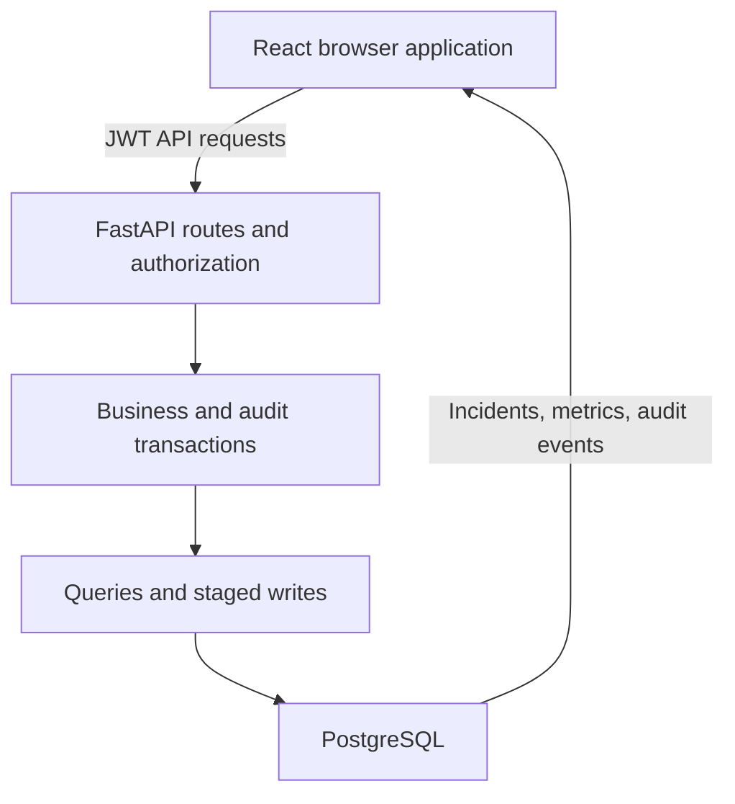
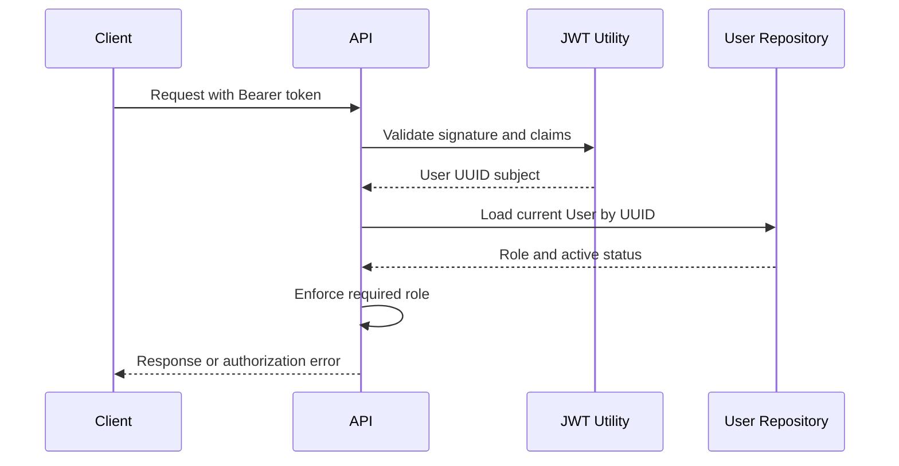
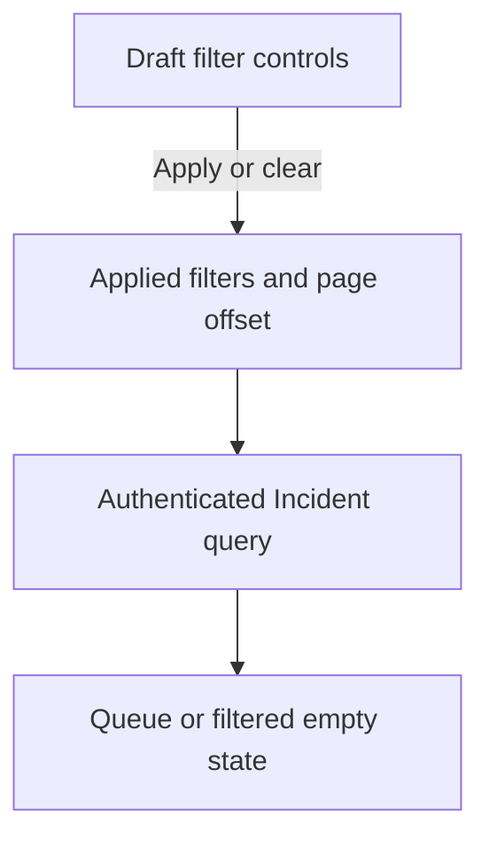

# Cloud Operations Platform Architecture

## Overview

Phase 6 extends the authenticated full-stack architecture with operational aggregation, server-side Incident filtering, and immutable audit history.

FastAPI remains the security and transaction boundary. Dashboard queries aggregate operational data without changing it. Incident and user mutations create their audit records inside the same SQLAlchemy transaction, preventing business state and audit history from diverging.

The React frontend consumes dedicated Incident, dashboard, and audit API modules. Every authenticated role can view dashboard metrics, while only administrators can request and view audit history.

## Current Architecture



The dashboard path performs read-only aggregate queries. The mutation path stages the resource change and its audit event before one service-owned commit.

## Components

| Component | Responsibility |
|---|---|
| Application layout | Presents authenticated navigation, role details, and page content |
| Dashboard page | Displays metrics, operational distributions, request states, and admin audit history |
| Incident workspace | Coordinates filters, pagination, selection, mutations, and feedback |
| Incident filters | Separates draft controls from applied API query values |
| Frontend API modules | Send authenticated Incident, dashboard, and audit requests |
| FastAPI dependencies | Validate bearer tokens and enforce database-backed roles |
| Incident routes and service | Enforce permissions and coordinate Incident transactions |
| Dashboard route and repository | Return authenticated read-only aggregate metrics |
| Audit route and repository | Return administrator-only immutable history |
| User service | Coordinates role or status mutations with audit events |
| SQLAlchemy repositories | Read records and stage writes without committing |
| PostgreSQL | Persists users, Incidents, and audit events |
| Alembic | Versions and applies database schema changes |
| Pytest | Exercises backend behavior with isolated database state |
| Vitest and Testing Library | Exercise frontend APIs and user-visible workflows |

## Backend Layered Design

```text
backend/app/
|-- api/
|   |-- dependencies/
|   |   `-- auth.py
|   `-- routes/
|       |-- auth.py
|       |-- incidents.py
|       `-- users.py
|-- cli/
|   `-- bootstrap_admin.py
|-- core/
|   |-- config.py
|   `-- security.py
|-- db/
|   |-- base.py
|   `-- session.py
|-- models/
|   |-- incident.py
|   `-- user.py
|-- repositories/
|   |-- incidents.py
|   `-- users.py
|-- schemas/
|   |-- incident.py
|   `-- user.py
|-- services/
|   |-- auth.py
|   `-- incidents.py
`-- main.py
```

| Layer | Responsibility |
|---|---|
| API route | Receives HTTP input and converts service errors into HTTP responses |
| Dependency | Resolves database sessions, bearer tokens, current users, and roles |
| Schema | Validates incoming data and controls public response fields |
| Service | Applies business rules and owns commit or rollback behavior |
| Repository | Reads records and stages database changes with `flush()` |
| Model | Defines persistent User and Incident representations |
| Database session | Provides one SQLAlchemy session per API request |
| Core configuration | Loads database and JWT settings from environment variables |
| Security utility | Performs Argon2 and JWT cryptographic operations |
| CLI command | Creates or promotes the first administrator securely |

## Authentication Design

### Registration

A successful registration follows this flow:

1. The client sends `POST /api/auth/register` with email, full name, and password.
2. Pydantic validates the email and password length.
3. The service normalizes the email to lowercase.
4. The service checks whether the normalized email already exists.
5. The password is hashed with Argon2.
6. The repository stages the User record.
7. The service commits the transaction.
8. FastAPI serializes the record using `UserResponse`.
9. The password and password hash are excluded from the response.

Public registration always assigns the `viewer` role. Clients cannot select `operator` or `admin` during registration.

### Login

A successful login follows this flow:

1. The client submits email and password to `POST /api/auth/token`.
2. The endpoint receives OAuth2-compatible form data.
3. The service looks up the normalized email.
4. The supplied password is verified against the Argon2 hash.
5. Disabled accounts are rejected.
6. The security utility creates a signed access token.
7. The API returns the bearer token and its lifetime.

Incorrect emails and passwords produce the same public error message. Authentication for an unknown email still performs password-hash verification to reduce observable timing differences.

### Authenticated Request



Every authenticated request reloads the User from the database.

This design means:

- Role changes apply to existing tokens immediately.
- Disabled accounts lose access immediately.
- Deleted users cannot continue using previously issued tokens.
- Authorization does not depend on a role claim stored in an older token.

## JWT Design

Access tokens contain:

| Claim | Purpose |
|---|---|
| `sub` | Stores the User UUID as the token subject |
| `type` | Identifies the token as an access token |
| `iat` | Records when the token was issued |
| `exp` | Rejects the token after its configured lifetime |
| `iss` | Identifies the Cloud Operations API as issuer |
| `aud` | Restricts the intended token consumer |

JWT validation:

- Accepts only the configured `HS256` algorithm
- Verifies the signature
- Verifies expiration
- Verifies issuer
- Verifies audience
- Requires an access-token type
- Requires a non-empty subject
- Requires the subject to be a valid User UUID

The JWT does not contain the User role.

## Role-Based Access Control

| Operation | Viewer | Operator | Admin |
|---|---:|---:|---:|
| View dashboard metrics | Yes | Yes | Yes |
| View audit history | No | No | Yes |
| List, retrieve, and filter incidents | Yes | Yes | Yes |
| Create incidents | No | Yes | Yes |
| Update incidents | No | Yes | Yes |
| Delete incidents | No | No | Yes |
| List and retrieve users | No | No | Yes |
| Change user roles or status | No | No | Yes |

Authenticated requests reload the current User from PostgreSQL. Role and account-status changes therefore apply immediately to existing tokens. Administrators cannot remove their own administrator role or disable their own account.

## Administrator Bootstrap

A new environment initially has no administrator.

The `app.cli.bootstrap_admin` command provides a controlled bootstrap path:

1. It searches for the normalized email.
2. If the User exists, it promotes the account to `admin`.
3. If the User does not exist, it securely prompts for a password.
4. It validates the new User through the same Pydantic schema.
5. It creates the User through the same service and repository layers.
6. It assigns the administrator role.
7. It reactivates the account when necessary.

The password is not accepted as a command-line argument, preventing it from being stored in shell history.

The command is idempotent and handles `Ctrl + C` without displaying a traceback.

## Transaction Management

Repositories use `flush()` to materialize generated identifiers and stage database changes without finalizing them. Services own every commit and rollback.

For audited mutations, the service performs these operations in one transaction:

1. Validate the actor and requested change.
2. Load the current resource state.
3. Stage the Incident or User mutation.
4. Build safe field-level change metadata.
5. Stage an immutable AuditEvent with actor and resource snapshots.
6. Commit both writes together.

Any exception rolls back both the business mutation and the audit event. Failed authorization, missing resources, and no-op changes do not produce audit records.

## User Data Model

The `users` table stores authenticated accounts.

| Column | Database Type | Rules |
|---|---|---|
| `id` | UUID | Primary key generated by the application |
| `email` | VARCHAR(320) | Required, normalized, and uniquely indexed |
| `full_name` | VARCHAR(120) | Required |
| `password_hash` | VARCHAR(255) | Required Argon2 hash |
| `role` | VARCHAR(8) | Required and defaults to `viewer` |
| `is_active` | BOOLEAN | Required and defaults to true |
| `created_at` | TIMESTAMP WITH TIME ZONE | Generated automatically |
| `updated_at` | TIMESTAMP WITH TIME ZONE | Updated automatically |

Supported role values:

```text
viewer
operator
admin
```

PostgreSQL enforces the values with the `user_role` CHECK constraint.

User indexes:

| Index | Purpose |
|---|---|
| `pk_users` | Provides unique UUID lookup |
| `ix_users_email` | Enforces unique email addresses and supports login lookup |
| `ix_users_role` | Supports role-based administration queries |
| `ix_users_is_active` | Supports account-status queries |

## Incident Data Model

The `incidents` table stores operational events.

| Column | Database Type | Rules |
|---|---|---|
| `id` | UUID | Primary key generated by the application |
| `title` | VARCHAR(200) | Required and indexed |
| `description` | TEXT | Required |
| `service_name` | VARCHAR(120) | Required and indexed |
| `severity` | VARCHAR(8) | Required and defaults to `medium` |
| `status` | VARCHAR(13) | Required, defaults to `open`, and is indexed |
| `created_at` | TIMESTAMP WITH TIME ZONE | Generated automatically |
| `updated_at` | TIMESTAMP WITH TIME ZONE | Updated automatically |

Supported severity values:

```text
low
medium
high
critical
```

Supported status values:

```text
open
investigating
resolved
closed
```

PostgreSQL enforces these values through:

```text
incident_severity
incident_status
```

Incident indexes:

| Index | Purpose |
|---|---|
| `pk_incidents` | Provides unique UUID lookup |
| `ix_incidents_title` | Supports future title searches |
| `ix_incidents_service_name` | Supports affected-service filtering |
| `ix_incidents_status` | Supports lifecycle-status filtering |

## Audit Event Data Model

The `audit_events` table stores immutable security and operational history.

| Column | Purpose |
|---|---|
| `id` | UUID primary key |
| `action` | Stable action such as `incident.updated` or `user.role_changed` |
| `actor_id` | Nullable reference to the acting User |
| `actor_email` | Safe actor snapshot retained if the User later changes |
| `resource_type` | Resource category such as `incident` or `user` |
| `resource_id` | Identifier of the affected resource |
| `resource_label` | Human-readable snapshot retained after deletion |
| `changes` | JSON field-level before-and-after metadata |
| `created_at` | Immutable event timestamp |

The application exposes no create, update, or delete audit route. Passwords, password hashes, bearer tokens, and secrets are never included in `changes`.

## Migration Strategy

Alembic reads the database URL from application settings and discovers models through `Base.metadata`.

| Revision | Change |
|---|---|
| `2ef9cb82e708` | Creates the Incident table, constraints, and indexes |
| `6b0140f7a01f` | Creates the User table, role constraint, and indexes |
| `7c9e4b2a6d10` | Creates the AuditEvent table and lookup indexes |

Schema changes follow a reviewed model, revision, upgrade, and `alembic check` workflow.

## Configuration and Security

Application configuration is documented in `.env.example`.

The private `.env` file is excluded through `.gitignore`. It contains:

- Local PostgreSQL credentials
- SQLAlchemy database URL
- JWT signing secret
- Token algorithm and lifetime
- Token issuer and audience
- Frontend backend-API address

The JWT secret is represented by Pydantic `SecretStr` to reduce accidental logging.

Backend controls include:

- Argon2 password hashing
- Minimum password length validation
- Normalized email uniqueness
- Generic incorrect-credentials responses
- Fixed JWT algorithm allowlist
- Expiration, issuer, and audience validation
- Database-backed roles and account status
- Public-registration role restriction
- Administrator self-lockout prevention
- Isolated test credentials

Frontend controls include:

- Session-scoped token storage
- Stored-token verification through `/api/auth/me`
- Rejected-token removal after `401` or `403`
- Safe internal return-path validation after login
- Public-only and authenticated route guards
- Administrator-only route presentation
- Structured API and network error handling
- Role-aware Incident mutation controls
- Explicit confirmation before administrator deletion

Frontend route restrictions do not replace backend authorization. Direct API requests are independently checked by FastAPI.

CORS currently permits only:

- `http://127.0.0.1:5173`
- `http://localhost:5173`

Production secrets, origins, and database URLs will be supplied through the deployment environment. Production deployment should also enforce HTTPS and a restrictive Content Security Policy.

## Testing Strategy

### Backend Validation

The backend suite contains **26 integration tests**. In addition to health, authentication, authorization, and CRUD behavior, Phase 6 covers Incident filters, dashboard aggregates, admin-only audit access, change metadata, actor snapshots, failed or no-op actions, and transaction rollback.

SQLite in-memory storage provides repeatable automated state. PostgreSQL-specific validation includes migration execution, `alembic check`, live route discovery, and manual create-update-delete audit verification.

### Frontend Validation

The frontend suite contains **31 tests across nine test files**. Phase 6 adds dashboard and audit API tests, dashboard role and retry behavior, Incident filter application and clearing, and filtered empty-state coverage.

The production Vite build validates imports, JSX transformation, CSS processing, and optimized bundle generation. Together, both suites provide **57 automated tests** without writing automated fixtures to the PostgreSQL development database.

## Frontend Design

The frontend separates API communication, authentication state, routing, reusable presentation, layouts, and page-level workflow coordination.

| Area | Responsibility |
|---|---|
| `src/api/incidents.js` | Sends authenticated CRUD, pagination, and filter requests |
| `src/api/dashboard.js` | Loads authenticated operational summary data |
| `src/api/audit-events.js` | Loads paginated administrator audit history |
| `src/components/IncidentFilters.jsx` | Owns accessible draft filter controls |
| `src/pages/IncidentsPage.jsx` | Applies filters and coordinates the Incident workflow |
| `src/pages/DashboardPage.jsx` | Coordinates metric and audit request states |
| `src/pages/IncidentsPage.filters.test.jsx` | Verifies filter and empty-state behavior |
| `src/pages/DashboardPage.test.jsx` | Verifies metrics, administrator visibility, and retry behavior |
| `src/index.css` | Defines responsive dashboard, audit, filter, and workspace styling |

### Incident Query Flow



Applying or clearing filters resets the offset to zero. Selection follows the returned result set, while role-specific mutation controls remain independent of filtering.

### Dashboard Flow

Dashboard metrics and administrator audit history use independent request states. A metric failure can be retried without exposing audit content, and a non-administrator never requests the audit endpoint.

### Route Structure

| Route | Guard | Layout |
|---|---|---|
| `/login` | Public only | Authentication layout |
| `/register` | Public only | Authentication layout |
| `/dashboard` | Authenticated | Application layout |
| `/incidents` | Authenticated | Application layout |
| `/users` | Administrator | Application layout |
| `/forbidden` | Authenticated | Application layout |
| Unmatched route | None | Not-found page |

## Local Ports

| Service | Local Port | Container Port |
|---|---:|---:|
| React development server | 5173 | Not containerized |
| FastAPI backend | 8000 | Not containerized |
| PostgreSQL | 5434 | 5432 |

Port 5434 avoids conflicts with default PostgreSQL installations and other portfolio databases.

## Implemented Phases

| Phase | Architecture Addition | Status |
|---|---|---|
| 1 | React frontend, FastAPI backend, health integration, and CORS | Complete |
| 2 | PostgreSQL, SQLAlchemy, Alembic, layered Incident CRUD, and tests | Complete |
| 3 | Argon2, JWT authentication, database-backed RBAC, and protected APIs | Complete |
| 4 | React Router, API clients, authentication state, protected layouts, and frontend tests | Complete |
| 5 | Role-aware Incident CRUD, pagination, request states, and workflow tests | Complete |
| 6 | Dashboard aggregates, Incident filters, immutable audit history, and atomic audit transactions | Complete |

## Planned Architecture Evolution

| Phase | Architecture Addition |
|---|---|
| 7 | Backend and frontend containers with Docker Compose networking |
| 8 | Automated validation and deployment workflows through GitHub Actions |
| 9 | Cloud hosting, production configuration, logging, and monitoring |
