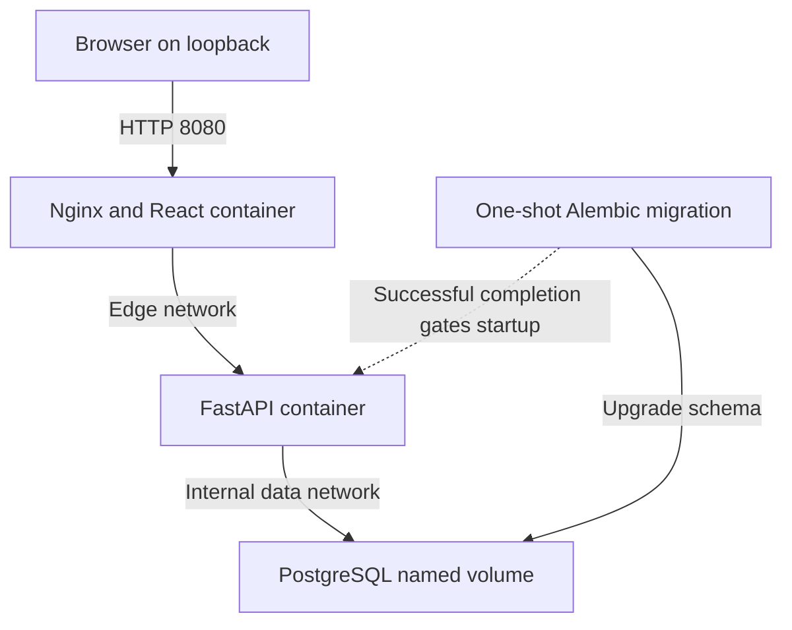
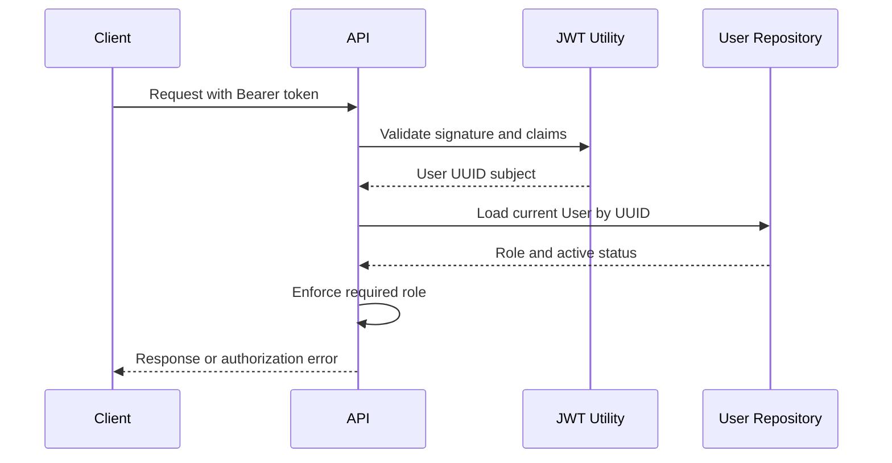
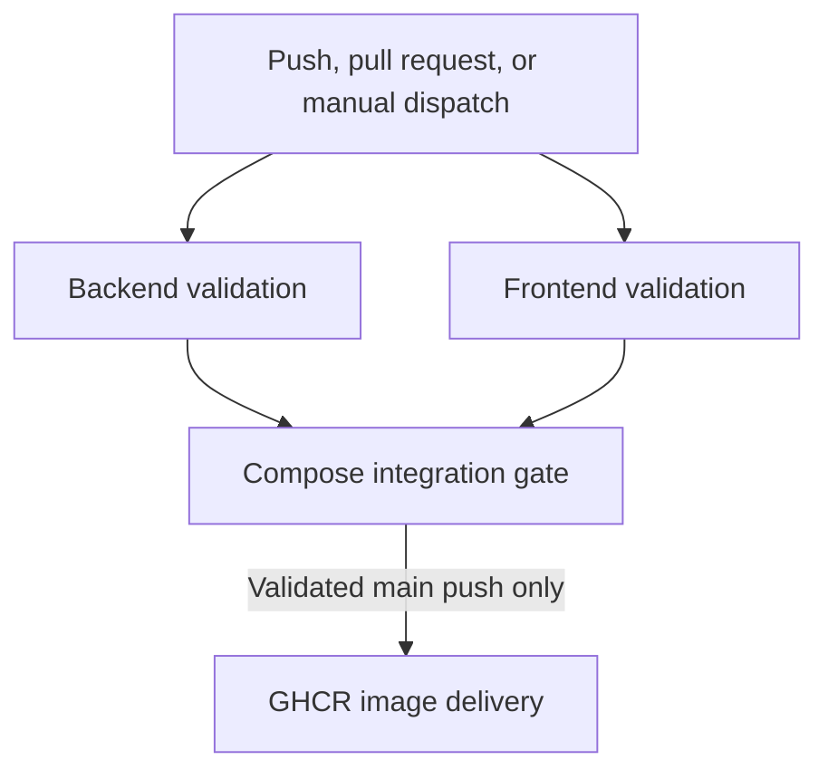
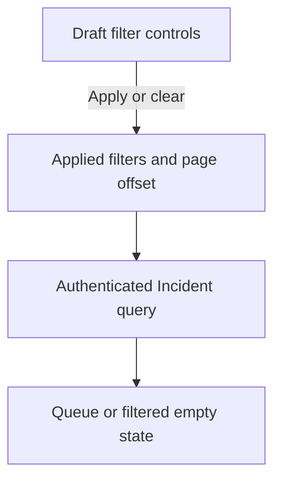

# Cloud Operations Platform Architecture

## Overview

Phase 8 adds a repository automation boundary around the Phase 7 containerized application. A path-scoped GitHub Actions workflow now validates backend behavior, frontend behavior, the migration graph, production builds, Compose startup, runtime identities, reverse-proxy behavior, and deployment readiness before code can progress to container delivery.

The runtime topology remains PostgreSQL, a one-shot Alembic migration, FastAPI, and an Nginx-served React application. FastAPI remains the authorization and transaction boundary; Nginx remains the browser-facing same-origin proxy. On successful direct pushes to `main`, the delivery job builds source-labeled backend and frontend images and publishes both immutable commit revisions and rolling main-branch references to GitHub Container Registry.

## Current Architecture



Only Nginx and the optional direct backend route publish ports, both on `127.0.0.1`. PostgreSQL is reachable only on the internal data network. The frontend cannot join the data network, and the database cannot join the edge network.

The runtime sequence is PostgreSQL health, migration exit code zero, backend health, then frontend health. This prevents application traffic from reaching a schema that has not been upgraded.

## Components

| Component | Responsibility |
|---|---|
| GitHub Actions workflow | Runs project-scoped backend, frontend, Compose, and delivery gates |
| CI smoke script | Uses the Python standard library to verify health, SPA fallback, assets, headers, caching, and required API paths |
| GitHub Container Registry | Stores commit-addressable backend and frontend deployment images |
| Docker Compose | Builds images, injects runtime configuration, orders startup, and joins services to least-privilege networks |
| PostgreSQL service | Persists users, Incidents, and audit events in a named volume |
| Migration service | Runs `alembic upgrade head` once after PostgreSQL becomes healthy |
| Backend container | Runs Uvicorn as UID and GID `10001:10001` after migration succeeds |
| Frontend container | Runs unprivileged Nginx as user `101`, serves React, and proxies backend routes |
| Application layout | Presents authenticated navigation, role details, and page content |
| Dashboard page | Displays metrics, operational distributions, request states, and admin audit history |
| Incident workspace | Coordinates filters, pagination, selection, mutations, and feedback |
| FastAPI dependencies | Validate bearer tokens and enforce database-backed roles |
| Services | Apply business rules and own transaction commit or rollback behavior |
| SQLAlchemy repositories | Read records and stage writes without committing |
| Alembic | Versions and applies database schema changes |
| Pytest | Exercises backend behavior with isolated database state |
| Vitest and Testing Library | Exercise frontend APIs and user-visible workflows |

## Backend Layered Design

```text
backend/
|-- app/
|   |-- api/
|   |   |-- dependencies/auth.py
|   |   `-- routes/
|   |       |-- audit_events.py
|   |       |-- auth.py
|   |       |-- dashboard.py
|   |       |-- incidents.py
|   |       `-- users.py
|   |-- cli/bootstrap_admin.py
|   |-- core/
|   |-- db/
|   |-- models/
|   |-- repositories/
|   |-- schemas/
|   |-- services/
|   `-- main.py
|-- migrations/
|-- tests/
|   `-- test_bootstrap_admin.py
|-- .dockerignore
`-- Dockerfile
```

| Layer | Responsibility |
|---|---|
| API route | Receives HTTP input and converts service errors into HTTP responses |
| Dependency | Resolves database sessions, bearer tokens, current users, and roles |
| Schema | Validates incoming data and controls public response fields |
| Service | Applies business rules and owns commit or rollback behavior |
| Repository | Reads records and stages database changes with `flush()` |
| Model | Defines persistent User, Incident, and AuditEvent representations |
| Database session | Provides one SQLAlchemy session per API request |
| Core configuration | Loads database and JWT settings from environment variables |
| Security utility | Performs Argon2 and JWT cryptographic operations |
| CLI command | Creates or promotes the first administrator securely and records audited role changes |
| Dockerfile | Builds dependencies separately and runs only application artifacts as a non-root user |

## Authentication Design

### Registration

A successful registration follows this flow:

1. The client sends `POST /api/auth/register` with email, full name, and password.
2. Pydantic validates the email and password length.
3. The service normalizes the email to lowercase.
4. The service checks whether the normalized email already exists.
5. The password is hashed with Argon2.
6. The repository stages the User record.
7. The service commits the transaction.
8. FastAPI serializes the record using `UserResponse`.
9. The password and password hash are excluded from the response.

Public registration always assigns the `viewer` role. Clients cannot select `operator` or `admin` during registration.

### Login

A successful login follows this flow:

1. The client submits email and password to `POST /api/auth/token`.
2. The endpoint receives OAuth2-compatible form data.
3. The service looks up the normalized email.
4. The supplied password is verified against the Argon2 hash.
5. Disabled accounts are rejected.
6. The security utility creates a signed access token.
7. The API returns the bearer token and its lifetime.

Incorrect emails and passwords produce the same public error message. Authentication for an unknown email still performs password-hash verification to reduce observable timing differences.

### Authenticated Request



Every authenticated request reloads the User from the database.

This design means:

- Role changes apply to existing tokens immediately.
- Disabled accounts lose access immediately.
- Deleted users cannot continue using previously issued tokens.
- Authorization does not depend on a role claim stored in an older token.

## JWT Design

Access tokens contain:

| Claim | Purpose |
|---|---|
| `sub` | Stores the User UUID as the token subject |
| `type` | Identifies the token as an access token |
| `iat` | Records when the token was issued |
| `exp` | Rejects the token after its configured lifetime |
| `iss` | Identifies the Cloud Operations API as issuer |
| `aud` | Restricts the intended token consumer |

JWT validation:

- Accepts only the configured `HS256` algorithm
- Verifies the signature
- Verifies expiration
- Verifies issuer
- Verifies audience
- Requires an access-token type
- Requires a non-empty subject
- Requires the subject to be a valid User UUID

The JWT does not contain the User role.

## Role-Based Access Control

| Operation | Viewer | Operator | Admin |
|---|---:|---:|---:|
| View dashboard metrics | Yes | Yes | Yes |
| View audit history | No | No | Yes |
| List, retrieve, and filter incidents | Yes | Yes | Yes |
| Create incidents | No | Yes | Yes |
| Update incidents | No | Yes | Yes |
| Delete incidents | No | No | Yes |
| List and retrieve users | No | No | Yes |
| Change user roles or status | No | No | Yes |

Authenticated requests reload the current User from PostgreSQL. Role and account-status changes therefore apply immediately to existing tokens. Administrators cannot remove their own administrator role or disable their own account.

## Administrator Bootstrap

A new environment initially has no administrator. The `app.cli.bootstrap_admin` command provides a controlled bootstrap path:

1. It searches for the normalized email.
2. If the User exists, it promotes the account to `admin`.
3. If the User does not exist, it securely prompts for a password.
4. It validates the new User through the same Pydantic schema.
5. It creates the User through the same service and repository layers.
6. It supplies the affected User as the required audit actor when changing role or status.
7. It reactivates the account when necessary.

The password is not accepted as a command-line argument, preventing it from being stored in shell history. The command is idempotent, handles `Ctrl + C` without displaying a traceback, and works inside the backend container through `docker compose exec`.

Bootstrap role and status mutations use the same service signatures as HTTP administration. The dedicated regression test verifies that `actor=user` remains present after authorization or audit-service changes.

## Transaction Management

Repositories use `flush()` to materialize generated identifiers and stage database changes without finalizing them. Services own every commit and rollback.

For audited mutations, the service performs these operations in one transaction:

1. Validate the actor and requested change.
2. Load the current resource state.
3. Stage the Incident or User mutation.
4. Build safe field-level change metadata.
5. Stage an immutable AuditEvent with actor and resource snapshots.
6. Commit both writes together.

Any exception rolls back both the business mutation and the audit event. Failed authorization, missing resources, and no-op changes do not produce audit records.

## User Data Model

The `users` table stores authenticated accounts.

| Column | Database Type | Rules |
|---|---|---|
| `id` | UUID | Primary key generated by the application |
| `email` | VARCHAR(320) | Required, normalized, and uniquely indexed |
| `full_name` | VARCHAR(120) | Required |
| `password_hash` | VARCHAR(255) | Required Argon2 hash |
| `role` | VARCHAR(8) | Required and defaults to `viewer` |
| `is_active` | BOOLEAN | Required and defaults to true |
| `created_at` | TIMESTAMP WITH TIME ZONE | Generated automatically |
| `updated_at` | TIMESTAMP WITH TIME ZONE | Updated automatically |

Supported role values:

```text
viewer
operator
admin
```

PostgreSQL enforces the values with the `user_role` CHECK constraint.

User indexes:

| Index | Purpose |
|---|---|
| `pk_users` | Provides unique UUID lookup |
| `ix_users_email` | Enforces unique email addresses and supports login lookup |
| `ix_users_role` | Supports role-based administration queries |
| `ix_users_is_active` | Supports account-status queries |

## Incident Data Model

The `incidents` table stores operational events.

| Column | Database Type | Rules |
|---|---|---|
| `id` | UUID | Primary key generated by the application |
| `title` | VARCHAR(200) | Required and indexed |
| `description` | TEXT | Required |
| `service_name` | VARCHAR(120) | Required and indexed |
| `severity` | VARCHAR(8) | Required and defaults to `medium` |
| `status` | VARCHAR(13) | Required, defaults to `open`, and is indexed |
| `created_at` | TIMESTAMP WITH TIME ZONE | Generated automatically |
| `updated_at` | TIMESTAMP WITH TIME ZONE | Updated automatically |

Supported severity values:

```text
low
medium
high
critical
```

Supported status values:

```text
open
investigating
resolved
closed
```

PostgreSQL enforces these values through:

```text
incident_severity
incident_status
```

Incident indexes:

| Index | Purpose |
|---|---|
| `pk_incidents` | Provides unique UUID lookup |
| `ix_incidents_title` | Supports future title searches |
| `ix_incidents_service_name` | Supports affected-service filtering |
| `ix_incidents_status` | Supports lifecycle-status filtering |

## Audit Event Data Model

The `audit_events` table stores immutable security and operational history.

| Column | Purpose |
|---|---|
| `id` | UUID primary key |
| `action` | Stable action such as `incident.updated` or `user.role_changed` |
| `actor_id` | Nullable reference to the acting User |
| `actor_email` | Safe actor snapshot retained if the User later changes |
| `resource_type` | Resource category such as `incident` or `user` |
| `resource_id` | Identifier of the affected resource |
| `resource_label` | Human-readable snapshot retained after deletion |
| `changes` | JSON field-level before-and-after metadata |
| `created_at` | Immutable event timestamp |

The application exposes no create, update, or delete audit route. Passwords, password hashes, bearer tokens, and secrets are never included in `changes`.

## Migration Strategy

Alembic reads the database URL from application settings and discovers models through `Base.metadata`.

| Revision | Change |
|---|---|
| `2ef9cb82e708` | Creates the Incident table, constraints, and indexes |
| `6b0140f7a01f` | Creates the User table, role constraint, and indexes |
| `7c9e4b2a6d10` | Creates the AuditEvent table and lookup indexes |

In Compose, migration is a one-shot service using the backend image. It waits for PostgreSQL health, runs `python -m alembic upgrade head`, and must exit successfully. The backend uses the `service_completed_successfully` dependency condition, so a failed migration blocks API startup instead of allowing a schema mismatch.

Schema changes follow a reviewed model, revision, upgrade, `alembic current`, and `alembic check` workflow. Migration files are copied into the backend image and are available to both the migration and API services.

## Container and Compose Architecture

### Service Topology

| Service | Image and runtime | Networks | Host exposure |
|---|---|---|---|
| `postgres` | `postgres:18-alpine` with named volume | Internal `data` | None |
| `migration` | Backend image; one-shot Alembic command | Internal `data` | None |
| `backend` | Python 3.12 slim; UID/GID `10001:10001` | `data`, `edge` | `127.0.0.1:8001` by default |
| `frontend` | Nginx Unprivileged 1.30 Alpine; user `101` | `edge` | `127.0.0.1:8080` by default |

The `data` network is declared `internal: true`. Only backend and migration workloads can reach PostgreSQL. The `edge` network connects Nginx to FastAPI without granting the frontend container direct database access.

### Images and Build Context

The backend Dockerfile separates dependency installation from its runtime stage, copies only Alembic and application files, compiles Python modules during build, and runs Uvicorn as a dedicated non-root identity. The frontend Dockerfile uses `npm ci` and Vite in its build stage, then copies only static output and Nginx configuration into the unprivileged runtime image. `.dockerignore` files exclude virtual environments, caches, test output, local dependencies, build output, and private environment files.

### Persistence and Lifecycle

The `postgres_data` named volume survives `docker compose down`, container recreation, and image rebuilds. `docker compose down --volumes` is intentionally destructive and removes local database state.

Service health checks cover `pg_isready`, the backend `/health` endpoint, and the frontend HTTP entry point. Compose conditions make these checks part of startup correctness instead of informational status only.

### Nginx Request Handling

Nginx serves the compiled React application on port `8080`. `/api/`, `/health`, `/docs`, `/redoc`, and `/openapi.json` are proxied to `backend:8000`; other browser routes use `index.html` as the SPA fallback. Fingerprinted assets receive one-year immutable caching and the application entry point receives no-cache behavior.

The server applies `X-Content-Type-Options: nosniff`, `X-Frame-Options: DENY`, and `Referrer-Policy: strict-origin-when-cross-origin`. Because location-specific cache headers normally replace inherited `add_header` values, Nginx 1.30 uses `add_header_inherit merge` to retain the security headers on pages, assets, and proxied responses.
## CI/CD Architecture



The workflow resides at `.github/workflows/cloud-operations-ci.yml` in the monorepo root. Its path filters include the complete cloud project and the workflow file itself. Pushes to `main` and `feature/**`, pull requests targeting `main`, and manual dispatches can run validation. A concurrency group based on workflow and Git ref cancels superseded runs on the same branch.

### Validation Gates

| Gate | Inputs and checks |
|---|---|
| Backend validation | Python 3.12, cached pinned requirements, source and test compilation, one Alembic head, and 27 Pytest cases |
| Frontend validation | Node.js 24, npm lockfile cache, clean `npm ci`, 31 Vitest cases, Vite build, and output checks |
| Compose integration | Four service images, healthy dependency order, migration exit zero, non-root runtime users, Alembic current revision, and HTTP smoke validation |
| Image delivery | Backend and frontend image builds, OCI source and revision labels, GHCR login, and four published references |

The Compose job uses an isolated project name, CI-only database and JWT values, and dedicated loopback ports. Diagnostic status and logs run even after failure, and `docker compose down --volumes --remove-orphans` always removes runner-local containers, networks, and data.

### Delivery Contract

Image delivery has an explicit `push` plus `refs/heads/main` condition and depends on all validation gates. The job alone receives `packages: write`; all other jobs retain `contents: read`. GitHub's job-scoped `GITHUB_TOKEN` authenticates to GHCR, so no long-lived registry credential is stored.

Published package names are `cloud-operations-backend` and `cloud-operations-frontend` under the lowercase repository-owner namespace. Each successful main build publishes the immutable Git commit SHA and updates the rolling `main` tag. Phase 9 deployment should consume the SHA tag for reproducible releases and use the rolling tag only for discovery.

## Configuration and Security

Application configuration is documented in `.env.example`; the private `.env` file is excluded through `.gitignore`. Compose requires `POSTGRES_PASSWORD` and `JWT_SECRET_KEY` during interpolation, constructs the container-only database URL with the `postgres` service hostname, and supplies runtime settings without baking secrets into images.

Backend controls include Argon2 password hashing, normalized email uniqueness, generic credential errors, strict JWT claim validation, database-backed roles and account status, administrator self-lockout protection, immutable audit history, and atomic audit transactions.

Container controls include:

- Required secret interpolation before Compose can render
- Non-root backend and frontend runtime identities
- An internal database network with no PostgreSQL host publication
- Separate edge connectivity for Nginx and FastAPI
- Loopback-only frontend and backend host bindings
- Health-gated database, migration, backend, and frontend startup
- Minimal runtime stages and restricted Docker build contexts
- Persistent data isolated in a named volume

Frontend and proxy controls include session-scoped token storage, stored-token verification, rejected-token removal, role-aware controls, same-origin API proxying, SPA fallback, explicit cache policy, and Nginx response security headers.

Automation controls include:

- Repository content access defaults to read-only
- Registry write access is isolated to the main-branch delivery job
- Pull requests, feature pushes, and manual runs cannot publish images
- CI database and JWT values exist only on the disposable runner
- Backend and frontend validation must both pass before Compose starts
- Compose must pass before registry delivery becomes eligible
- Failure diagnostics do not expose private environment files
- Runner-local containers, networks, and volumes are always removed
- OCI labels bind published images to their source repository and revision

Local Vite development permits `http://127.0.0.1:5173` and `http://localhost:5173` through CORS. The Compose frontend uses same-origin proxy requests and does not require an additional browser origin. Cloud deployment must use HTTPS, managed secrets, production origin configuration, a restrictive Content Security Policy, immutable SHA-tagged images, and environment-specific release approval.

## Testing Strategy

### Backend Validation

The backend suite contains **27 integration tests**. It covers health, authentication, database-backed authorization, CRUD behavior, Incident filters, dashboard aggregates, admin-only audit access, safe change metadata, actor snapshots, failed or no-op mutations, transaction rollback, and administrator-bootstrap audit-actor integration.

SQLite in-memory storage provides repeatable automated state. The backend CI gate installs pinned requirements, compiles source and tests, verifies a single Alembic head, and executes the complete suite without requiring a persistent database service.

### Frontend Validation

The frontend suite contains **31 tests across nine test files**. It covers session state, route guards, API clients, role-aware Incident workflows, pagination, dashboard and audit presentation, filter application and clearing, empty states, and recoverable errors.

The frontend CI gate performs a clean lockfile installation, runs the complete suite, builds optimized Vite assets, and verifies the generated entry point and JavaScript bundle. Together, both suites provide **58 automated tests** without writing automated fixtures to PostgreSQL development data.

### Compose and Delivery Validation

The Compose gate builds the backend and frontend images, creates a temporary PostgreSQL volume, applies all Alembic revisions, waits for backend and frontend health, checks migration exit zero, and confirms UID/GID `10001:10001` and user `101` runtime identities.

The standard-library smoke script verifies direct and proxied health, React SPA fallback, JavaScript delivery, Nginx security headers, combined cache directives, and required OpenAPI routes. Only after this gate passes can a main-branch run enter image delivery. The feature-branch workflow was validated successfully on GitHub Actions before Phase 8 documentation completion.

## Frontend Design

The frontend separates API communication, authentication state, routing, reusable presentation, layouts, and page-level workflow coordination. Vite compiles this source into fingerprinted production assets; Nginx serves those assets and proxies backend traffic through one browser origin.

| Area | Responsibility |
|---|---|
| `src/api/incidents.js` | Sends authenticated CRUD, pagination, and filter requests |
| `src/api/dashboard.js` | Loads authenticated operational summary data |
| `src/api/audit-events.js` | Loads paginated administrator audit history |
| `src/components/IncidentFilters.jsx` | Owns accessible draft filter controls |
| `src/pages/IncidentsPage.jsx` | Applies filters and coordinates the Incident workflow |
| `src/pages/DashboardPage.jsx` | Coordinates metric and audit request states |
| `src/pages/IncidentsPage.filters.test.jsx` | Verifies filter and empty-state behavior |
| `src/pages/DashboardPage.test.jsx` | Verifies metrics, administrator visibility, and retry behavior |
| `src/index.css` | Defines responsive dashboard, audit, filter, and workspace styling |
| `frontend/Dockerfile` | Builds the Vite bundle and creates the unprivileged Nginx runtime |
| `frontend/nginx.conf` | Defines proxy routes, SPA fallback, caching, health behavior, and security headers |

### Incident Query Flow



Applying or clearing filters resets the offset to zero. Selection follows the returned result set, while role-specific mutation controls remain independent of filtering.

### Dashboard Flow

Dashboard metrics and administrator audit history use independent request states. A metric failure can be retried without exposing audit content, and a non-administrator never requests the audit endpoint.

### Route Structure

| Route | Guard | Layout |
|---|---|---|
| `/login` | Public only | Authentication layout |
| `/register` | Public only | Authentication layout |
| `/dashboard` | Authenticated | Application layout |
| `/incidents` | Authenticated | Application layout |
| `/users` | Administrator | Application layout |
| `/forbidden` | Authenticated | Application layout |
| Unmatched route | None | Not-found page |

## Local Ports

| Runtime | Service | Host Port | Container Port |
|---|---|---:|---:|
| Docker Compose | Production frontend and reverse proxy | 8080 | 8080 |
| Docker Compose | Direct backend diagnostics and documentation | 8001 | 8000 |
| Docker Compose | PostgreSQL | Not published | 5432 |
| Manual development | React development server | 5173 | Not containerized |
| Manual development | FastAPI backend | 8000 | Not containerized |
| Manual development | PostgreSQL | 5434 | 5432 |

Compose host ports can be changed with `COMPOSE_FRONTEND_PORT` and `COMPOSE_BACKEND_PORT`. Published ports bind to `127.0.0.1`; PostgreSQL remains internal. Manual port 5434 avoids conflicts with default PostgreSQL installations and other portfolio databases.

## Implemented Phases

| Phase | Architecture Addition | Status |
|---|---|---|
| 1 | React frontend, FastAPI backend, health integration, and CORS | Complete |
| 2 | PostgreSQL, SQLAlchemy, Alembic, layered Incident CRUD, and tests | Complete |
| 3 | Argon2, JWT authentication, database-backed RBAC, and protected APIs | Complete |
| 4 | React Router, API clients, authentication state, protected layouts, and frontend tests | Complete |
| 5 | Role-aware Incident CRUD, pagination, request states, and workflow tests | Complete |
| 6 | Dashboard aggregates, Incident filters, immutable audit history, and atomic audit transactions | Complete |
| 7 | Multi-stage containers, Compose networking, migration gating, persistence, and Nginx integration | Complete |
| 8 | Path-scoped validation gates and GHCR container delivery through GitHub Actions | Complete |

## Planned Architecture Evolution

| Phase | Architecture Addition |
|---|---|
| 9 | Cloud hosting, production configuration, logging, and monitoring |
