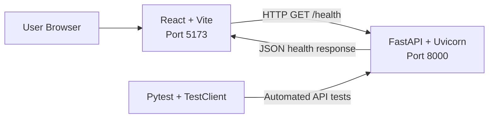

# Cloud Operations Platform Architecture

## Overview

The Cloud Operations Platform currently uses a client-server architecture composed of a React single-page application and a FastAPI REST API.

Phase 1 establishes the foundation for future database, authentication, containerization, CI/CD, and cloud deployment work.

## Current Architecture



## Components

| Component | Responsibility |
|---|---|
| React frontend | Presents the user interface and displays backend availability |
| Vite | Runs the development server and creates optimized production builds |
| FastAPI backend | Exposes REST endpoints and application health information |
| Uvicorn | Runs the FastAPI application as an ASGI server |
| Pytest | Executes automated backend tests |
| HTTPX2 | Provides HTTP request support for the backend test client |

## Request Flow

1. The user opens the React application at `http://127.0.0.1:5173`.
2. React sends a `GET` request to `http://127.0.0.1:8000/health`.
3. FastAPI processes the request through the `/health` route.
4. The backend returns the service health information as JSON.
5. React displays either a connected or unavailable status.

Example response:

```json
{
  "status": "healthy",
  "service": "cloud-operations-api"
}
```

## Backend Design

The backend entry point is located at:

```text
backend/app/main.py
```

It currently contains:

- FastAPI application configuration
- Local CORS middleware
- Root service endpoint
- Health-check endpoint

The backend is intentionally small during Phase 1. Database models, repositories, service logic, and additional API routes will be introduced in later phases.

## Frontend Design

The frontend uses three primary source files:

| File | Responsibility |
|---|---|
| `src/main.jsx` | Creates the React root and renders the application |
| `src/App.jsx` | Performs the backend health request and displays the result |
| `src/index.css` | Defines the global layout and visual styling |

The backend URL is read from:

```text
VITE_API_BASE_URL
```

If the environment variable is unavailable, the frontend uses:

```text
http://127.0.0.1:8000
```

## Local Ports

| Service | Port |
|---|---:|
| React development server | 5173 |
| FastAPI backend | 8000 |

## Configuration and Security

Local settings are documented in `.env.example`.

The real `.env` file is excluded through `.gitignore` to prevent credentials and local configuration from being committed to Git.

CORS currently permits only the local React development addresses:

```text
http://127.0.0.1:5173
http://localhost:5173
```

Production origins will be supplied through environment configuration during cloud deployment.

## Testing Strategy

Phase 1 includes an automated health endpoint test.

The test verifies that:

- The `/health` endpoint is available
- The response status is `200`
- The response body contains the expected service status
- The application can be tested without starting an external server

Additional unit, integration, and frontend tests will be introduced as the system grows.

## Planned Architecture Evolution

| Phase | Architecture Addition |
|---|---|
| 2 | PostgreSQL, SQLAlchemy models, migrations, and repository layer |
| 3 | Authentication, authorization, and protected API routes |
| 4 | React routing, reusable components, and application state |
| 5 | Incident management workflow and business services |
| 6 | Dashboard queries, filtering, and audit history |
| 7 | Docker containers and Docker Compose networking |
| 8 | Automated validation through GitHub Actions |
| 9 | Cloud hosting, production configuration, logging, and monitoring |