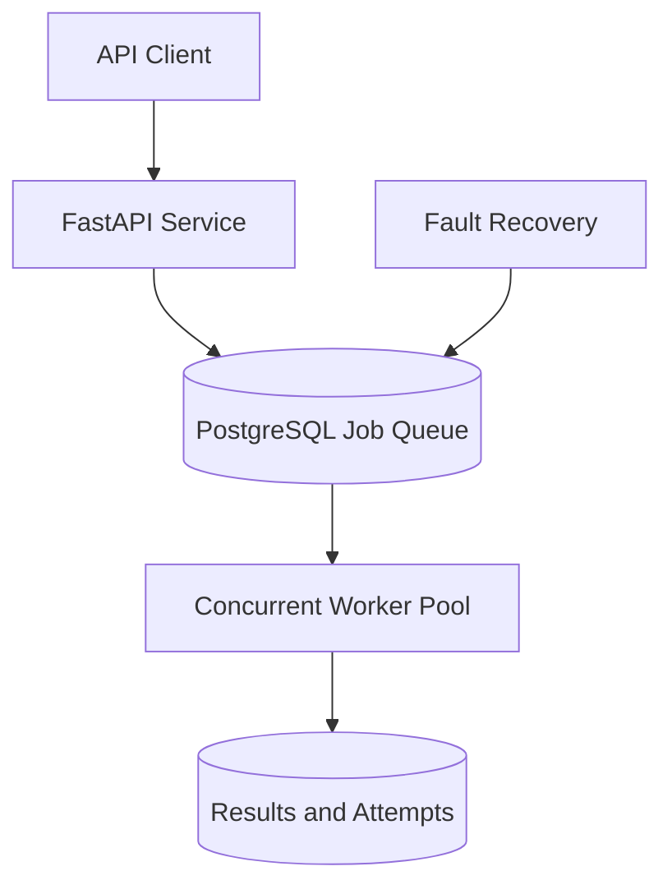

# Distributed Job Processing System

A portfolio-grade distributed job queue built with Python, FastAPI, PostgreSQL, and SQLAlchemy.

**Current version:** `0.2.0`
**Current status:** Phase 2 of 8 completed

## Overview

This project demonstrates how a durable background job-processing platform is designed and built incrementally. API clients can submit jobs, store them safely in PostgreSQL, retrieve individual jobs, and search the queue using filters and pagination.

Future phases will add concurrent workers, atomic job claiming, retries, idempotency, fault recovery, and observability.

## Architecture



## Implemented Capabilities

### Phase 1 — Project Foundation

- Python 3.12 project with a professional `src` layout
- FastAPI application and interactive Swagger documentation
- Liveness health check
- Asynchronous API tests
- Ruff linting and formatting

### Phase 2 — Persistent Job Queue

- PostgreSQL 17 development database
- Docker Compose configuration and persistent database volume
- Async SQLAlchemy engine and session management
- Environment-based configuration
- Alembic database migrations
- UUID-based jobs
- JSONB job payloads
- Queue names and priorities
- Job-status validation
- PostgreSQL readiness check
- Create, retrieve, list, filter, and paginate jobs
- Repository, service, and API layers

## API Endpoints

| Method | Endpoint | Description |
| --- | --- | --- |
| `GET` | `/` | Return service information |
| `GET` | `/health/live` | Confirm that the API process is running |
| `GET` | `/health/ready` | Confirm PostgreSQL connectivity |
| `POST` | `/jobs` | Create and persist a queued job |
| `GET` | `/jobs` | List jobs with filtering and pagination |
| `GET` | `/jobs/{job_id}` | Retrieve one job by UUID |
| `GET` | `/docs` | Open interactive Swagger documentation |

### Create a Job

```json
{
  "queue": "reports",
  "task_name": "generate-report",
  "payload": {
    "report_id": "sales-2026-09",
    "format": "pdf"
  },
  "priority": 10
}
```

A newly submitted job receives a UUID and begins with the `queued` status.

## Local Setup

### 1. Create the Python environment

```powershell
py -3.12 -m venv .venv
.\.venv\Scripts\Activate.ps1
python -m pip install --upgrade pip
python -m pip install -e ".[dev]"
```

### 2. Create the local environment file

```powershell
Copy-Item .env.example .env
```

The local PostgreSQL service uses port `5433` to avoid conflicts with other projects.

### 3. Start PostgreSQL

```powershell
docker compose up -d postgres
docker compose ps
```

### 4. Apply database migrations

```powershell
alembic upgrade head
alembic current
```

### 5. Start the API

```powershell
uvicorn job_system.main:app --reload
```

Open Swagger UI at:

```text
http://127.0.0.1:8000/docs
```

### 6. Stop local services

```powershell
docker compose down
```

The named Docker volume preserves PostgreSQL data between container restarts.

## Quality Checks

```powershell
ruff check .
pytest
alembic check
docker compose config --quiet
```

Current automated test count: **6**

## Project Structure

```text
distributed-job-processing-system/
├── migrations/
│   ├── versions/
│   │   └── b63bc8dd8717_create_jobs_table.py
│   ├── env.py
│   └── script.py.mako
├── src/
│   └── job_system/
│       ├── api/
│       │   ├── __init__.py
│       │   └── jobs.py
│       ├── __init__.py
│       ├── config.py
│       ├── db.py
│       ├── main.py
│       ├── models.py
│       ├── repository.py
│       ├── schemas.py
│       └── services.py
├── tests/
│   ├── conftest.py
│   ├── test_health.py
│   └── test_jobs_api.py
├── .env.example
├── .gitignore
├── alembic.ini
├── compose.yaml
├── pyproject.toml
└── README.md
```

## Development Roadmap

- [x] Phase 1 — Project Foundation
- [x] Phase 2 — Persistent Job Queue
- [ ] Phase 3 — Workers and Concurrency
- [ ] Phase 4 — Retry and Dead-Letter Queue
- [ ] Phase 5 — Idempotency
- [ ] Phase 6 — Fault Recovery
- [ ] Phase 7 — Observability
- [ ] Phase 8 — Production Readiness

## Author

AJ C Pipattanakun