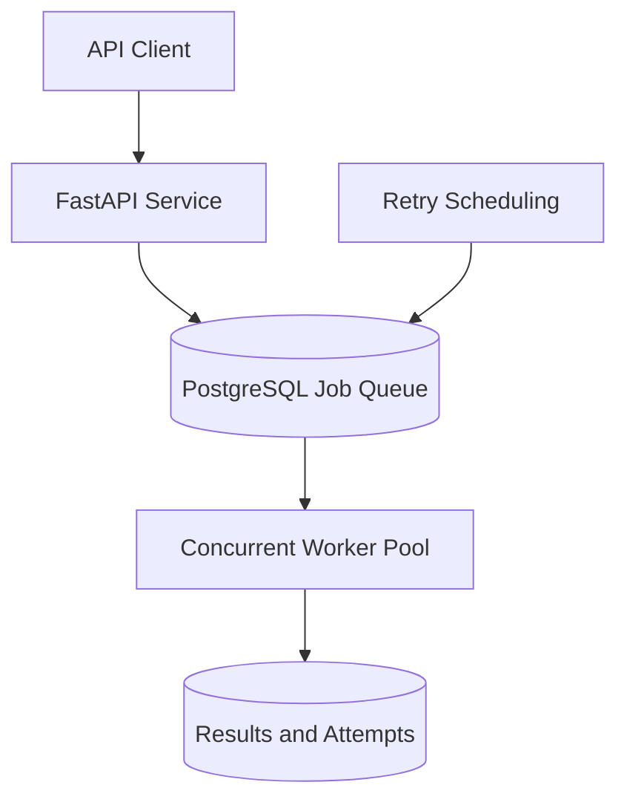

# Distributed Job Processing System

A portfolio-grade distributed job queue built with Python, FastAPI, PostgreSQL, and SQLAlchemy.

**Current version:** `0.7.0`
**Current status:** Phase 7 of 8 completed

## Overview

This project demonstrates how a durable background job-processing platform is designed and built incrementally. API clients can submit jobs to PostgreSQL, while concurrent workers atomically claim and execute available work.

Failed jobs are classified as retryable or non-retryable. Retryable jobs use scheduled exponential backoff and transition to the dead-letter queue after exhausting their configured attempts.

The system now includes idempotent submissions, worker fault recovery, Prometheus metrics, and structured JSON logging. The final phase will focus on production readiness.

## Architecture



## Implemented Capabilities

### Phase 1 - Project Foundation

- Python 3.12 project with a professional `src` layout
- FastAPI application and interactive Swagger documentation
- Liveness health check
- Asynchronous API tests
- Ruff linting and formatting

### Phase 2 - Persistent Job Queue

- PostgreSQL 17 development database
- Docker Compose configuration and persistent database volume
- Async SQLAlchemy engine and session management
- Environment-based configuration
- Alembic database migrations
- UUID-based jobs
- JSONB job payloads
- Queue names and priorities
- Job-status validation
- PostgreSQL readiness check
- Create, retrieve, list, filter, and paginate jobs
- Repository, service, and API layers

### Phase 3 - Workers and Concurrency

- PostgreSQL-backed worker runtime
- Atomic job claiming with `FOR UPDATE SKIP LOCKED`
- Configurable queue subscriptions and worker concurrency
- Concurrent asynchronous worker slots
- Priority-first and FIFO job selection
- Task-handler registry for report, email, and echo jobs
- Persistent worker ownership and attempt counts
- Successful result persistence
- Graceful shutdown that allows active jobs to finish
- Worker CLI available through `job-worker`

### Phase 4 - Retry and Dead-Letter Queue

- Configurable maximum attempts per job
- Retryable and non-retryable error classification
- Persistent `retry_scheduled` job state
- Time-based retry availability
- Exponential backoff with a configurable maximum delay
- Worker claims only jobs whose `available_at` time has arrived
- Automatic transition to `dead_lettered` after attempts are exhausted
- Immediate dead-lettering for invalid or unsupported tasks
- Unit tests for retry policy and backoff calculations
- PostgreSQL lifecycle validation from initial claim through dead-lettering

### Phase 5 - Idempotency

- Optional client-provided idempotency keys
- PostgreSQL unique constraint for atomic duplicate prevention
- Concurrent-safe insertion with `ON CONFLICT DO NOTHING`
- Repeated identical submissions return the existing job
- Conflicting reuse of an idempotency key returns HTTP `409`
- Submissions without an idempotency key remain independent
- Request validation for idempotency-key length and format
- API and PostgreSQL concurrency validation

### Phase 6 - Fault Recovery

- Time-limited worker ownership using database-backed leases
- Periodic heartbeats that renew leases for actively running jobs
- Configurable lease, heartbeat, and recovery intervals
- Automatic detection of jobs abandoned by crashed workers
- Atomic stale-job recovery with `FOR UPDATE SKIP LOCKED`
- Immediate retry scheduling when execution attempts remain
- Automatic dead-lettering after all attempts are exhausted
- Protection against result updates from workers that lost ownership
- Validation that heartbeat intervals are shorter than lease durations
- PostgreSQL validation of retry recovery and terminal recovery paths

### Phase 7 - Observability

- Prometheus-compatible metrics for API and worker processes
- API metrics exposed through `GET /metrics`
- Dedicated worker metrics server on a configurable port
- Job submission counters for created, replayed, and conflicting requests
- Worker counters for claimed jobs and persisted lifecycle transitions
- Lease-renewal metrics for renewed, lost, and error outcomes
- Stale-job recovery counters for retry and dead-letter outcomes
- Job-processing duration histogram
- Structured JSON logging with timestamps, severity, and event context
- Job, worker, task, slot, and status fields for lifecycle logs
- Automated tests for metrics and structured log output
- End-to-end validation using a live API, worker, and PostgreSQL

## API Endpoints

| Method | Endpoint | Description |
| --- | --- | --- |
| `GET` | `/` | Return service information |
| `GET` | `/health/live` | Confirm that the API process is running |
| `GET` | `/health/ready` | Confirm PostgreSQL connectivity |
| `GET` | `/metrics` | Expose API metrics in Prometheus text format |
| `POST` | `/jobs` | Create and persist a queued job |
| `GET` | `/jobs` | List jobs with filtering and pagination |
| `GET` | `/jobs/{job_id}` | Retrieve one job by UUID |
| `GET` | `/docs` | Open interactive Swagger documentation |

### Create a Job

```json
{
  "queue": "reports",
  "task_name": "generate-report",
  "payload": {
    "report_id": "sales-2026-09",
    "format": "pdf"
  },
  "priority": 10,
  "max_attempts": 3,
  "idempotency_key": "report-sales-2026-09"
}
```

A newly submitted job receives a UUID, begins with the `queued` status, and defaults to three total execution attempts.

## Local Setup

### 1. Create the Python environment

```powershell
py -3.12 -m venv .venv
.\.venv\Scripts\Activate.ps1
python -m pip install --upgrade pip
python -m pip install -e ".[dev]"
```

### 2. Create the local environment file

```powershell
Copy-Item .env.example .env
```

The local PostgreSQL service uses port `5433` to avoid conflicts with other projects.

Worker settings can be configured through:

```dotenv
JOB_WORKER_QUEUES=default,reports,emails
JOB_WORKER_CONCURRENCY=4
JOB_WORKER_POLL_INTERVAL_SECONDS=0.5
JOB_WORKER_RETRY_BASE_DELAY_SECONDS=5
JOB_WORKER_RETRY_MAX_DELAY_SECONDS=300
JOB_WORKER_LEASE_DURATION_SECONDS=30
JOB_WORKER_HEARTBEAT_INTERVAL_SECONDS=5
JOB_WORKER_RECOVERY_INTERVAL_SECONDS=10
JOB_WORKER_METRICS_PORT=9000
```
The API exposes Prometheus metrics at `http://127.0.0.1:8000/metrics`. Each worker exposes its own process metrics at `http://127.0.0.1:9000/metrics` by default.

### 3. Start PostgreSQL

```powershell
docker compose up -d postgres
docker compose ps
```

### 4. Apply database migrations

```powershell
alembic upgrade head
alembic current
```

### 5. Start the API

```powershell
uvicorn job_system.main:app --reload
```

Open Swagger UI at:

```text
http://127.0.0.1:8000/docs
```

### 6. Start a Worker

Open another terminal, activate the virtual environment, and run:

```powershell
.\.venv\Scripts\Activate.ps1
job-worker
```

The worker consumes jobs from the configured queues and processes up to four jobs concurrently by default. Press `Ctrl+C` to stop claiming new jobs and allow active jobs to finish.

Worker logs are emitted as structured JSON. The worker metrics server runs independently from the API metrics endpoint and uses port `9000` by default.

### 7. Stop local services

```powershell
docker compose down
```

The named Docker volume preserves PostgreSQL data between container restarts.

## Quality Checks

```powershell
ruff check .
ruff format --check .
pytest
alembic check
docker compose config --quiet
```

Current automated test count: **42**

## Project Structure

```text
distributed-job-processing-system/
|-- migrations/
|   |-- versions/
|   |   |-- b63bc8dd8717_create_jobs_table.py
|   |   |-- ab243a2532b3_add_worker_processing_fields.py
|   |   |-- f233f5d3a0fd_add_retry_scheduling_fields.py
|   |   |-- b5f3b0955c95_add_job_idempotency_key.py
|   |   `-- 5bb6c4b76aca_add_worker_lease_fields.py
|   |-- env.py
|   `-- script.py.mako
|-- src/
|   `-- job_system/
|       |-- api/
|       |   |-- __init__.py
|       |   `-- jobs.py
|       |-- __init__.py
|       |-- config.py
|       |-- db.py
|       |-- handlers.py
|       |-- main.py
|       |-- models.py
|       |-- observability.py
|       |-- queue.py
|       |-- repository.py
|       |-- schemas.py
|       |-- services.py
|       `-- worker.py
|-- tests/
|   |-- conftest.py
|   |-- test_config.py
|   |-- test_handlers.py
|   |-- test_health.py
|   |-- test_jobs_api.py
|   |-- test_observability.py
|   |-- test_queue.py
|   `-- test_worker.py
|-- .env.example
|-- .gitignore
|-- alembic.ini
|-- compose.yaml
|-- pyproject.toml
`-- README.md
```

## Development Roadmap

- [x] Phase 1 - Project Foundation
- [x] Phase 2 - Persistent Job Queue
- [x] Phase 3 - Workers and Concurrency
- [x] Phase 4 - Retry and Dead-Letter Queue
- [x] Phase 5 - Idempotency
- [x] Phase 6 - Fault Recovery
- [x] Phase 7 - Observability
- [ ] Phase 8 - Production Readiness

## Author

AJ C Pipattanakun