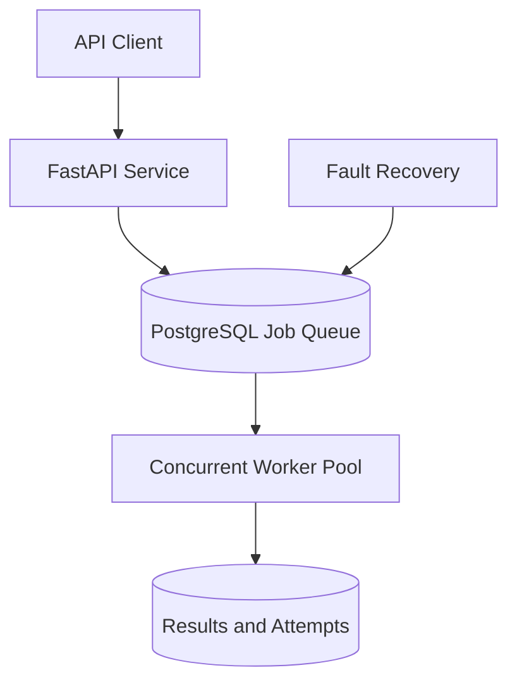

# Distributed Job Processing System

A portfolio-grade distributed job queue built with Python and FastAPI.  
The system is designed to process background jobs safely across multiple workers while supporting concurrency, retries, idempotency, and fault recovery.

## Project Status

**Phase 1 of 8 — Project Foundation completed**

## Target Architecture



## Planned Capabilities

- Durable PostgreSQL-backed job queue
- Multiple queues and job priorities
- Concurrent distributed workers
- Atomic job claiming
- Scheduled jobs
- Exponential retry with jitter
- Dead-letter queue
- Idempotent job submission and execution
- Worker leases and heartbeats
- Automatic recovery after worker failure
- Structured logging and metrics
- Integration, load, and fault-injection tests

## Phase 1 Features

- Professional `src` project structure
- FastAPI application
- Service information endpoint
- Liveness health check
- Typed response models
- Asynchronous API tests
- Ruff code-quality checks
- Editable development installation
- Interactive Swagger documentation

## API Endpoints

| Method | Endpoint | Description |
| --- | --- | --- |
| `GET` | `/` | Return service name and version |
| `GET` | `/health/live` | Confirm that the API process is running |
| `GET` | `/docs` | Open interactive Swagger documentation |

## Local Setup

Requires Python 3.12 or newer.

```powershell
py -3.12 -m venv .venv
.\.venv\Scripts\Activate.ps1
python -m pip install --upgrade pip
python -m pip install -e ".[dev]"
```

Start the API:

```powershell
uvicorn job_system.main:app --reload
```

Open Swagger UI at:

```text
http://127.0.0.1:8000/docs
```

## Quality Checks

Run the automated tests:

```powershell
pytest
```

Run the linter:

```powershell
ruff check .
```

## Project Structure

```text
distributed-job-processing-system/
├── src/
│   └── job_system/
│       ├── __init__.py
│       └── main.py
├── tests/
│   └── test_health.py
├── .gitignore
├── pyproject.toml
└── README.md
```

## Development Roadmap

- [x] Phase 1 — Project Foundation
- [ ] Phase 2 — Persistent Job Queue
- [ ] Phase 3 — Workers and Concurrency
- [ ] Phase 4 — Retry and Dead-Letter Queue
- [ ] Phase 5 — Idempotency
- [ ] Phase 6 — Fault Recovery
- [ ] Phase 7 — Observability
- [ ] Phase 8 — Production Readiness

## Author

AJ C Pipattanakun