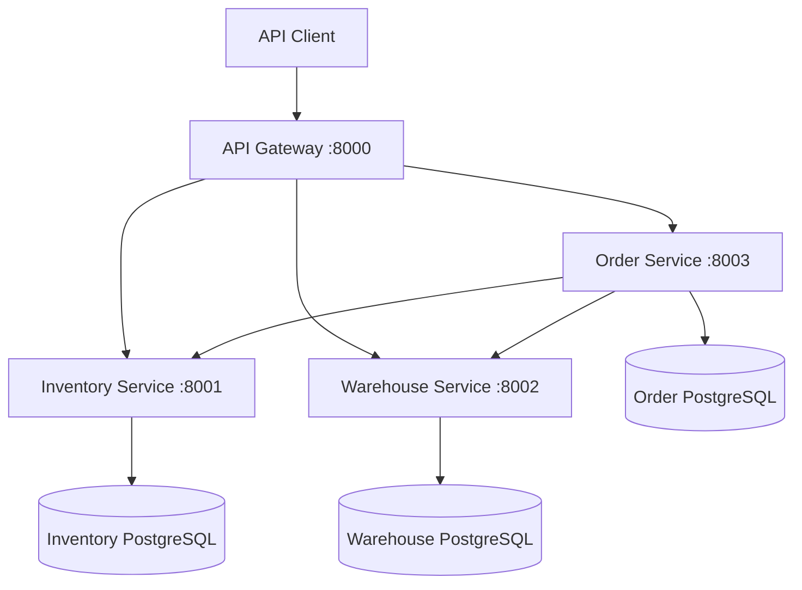

# Production Warehouse Microservices

[](https://github.com/AJooujee/Software_Engineering_Career_Projects/actions/workflows/production-warehouse-microservices-ci.yml)

A production-oriented warehouse management backend built with Python, FastAPI, PostgreSQL, SQLAlchemy, Alembic, Docker Compose, automated testing, and GitHub Actions.

The platform separates inventory, warehouse, and order responsibilities into independently deployable services. An API Gateway provides one public entry point on port `8000`.

## Architecture



Each data-owning service uses its own PostgreSQL database. Services communicate through HTTP APIs rather than accessing another service's database directly.

## Services

| Service | Port | Responsibility |
|---|---:|---|
| API Gateway | 8000 | Public entry point, request proxying, and downstream health aggregation |
| Inventory Service | 8001 | Products, balances, movements, receipts, issues, transfers, reservations, and releases |
| Warehouse Service | 8002 | Warehouse creation, retrieval, listing, updating, and deletion |
| Order Service | 8003 | Order lifecycle, warehouse/product validation, stock reservations, confirmation, cancellation, and compensation |
| Inventory PostgreSQL | 5433 | Inventory-owned product and stock data |
| Warehouse PostgreSQL | 5434 | Warehouse-owned data |
| Order PostgreSQL | 5435 | Order and order-item data |

## Key Engineering Features

- Independently structured FastAPI microservices
- Database-per-service ownership
- PostgreSQL persistence through SQLAlchemy 2
- Alembic database migrations
- Pydantic v2 request and response validation
- Atomic inventory balance updates
- Order-scoped stock reservations
- Saga-style compensation when a multi-item reservation fails
- API Gateway routing for all public business endpoints
- Docker health checks and dependency-aware startup
- Non-root application containers
- Structured JSON request logging
- End-to-end `X-Request-ID` propagation
- Unit, service, compensation, and proxy tests
- Full-stack automated smoke testing
- GitHub Actions matrix CI

## Order Lifecycle

An order progresses through the following states:

```text
PENDING -> RESERVED -> CONFIRMED
                    -> CANCELLED
```

When an order is created:

1. The Order Service verifies that the warehouse exists.
2. Product information is retrieved from the Inventory Service.
3. Stock is reserved against the order ID.
4. If every reservation succeeds, the order becomes `RESERVED`.
5. If one reservation fails, previously completed reservations are released.
6. Cancelling a reserved order releases its inventory.
7. Confirming a reserved order completes the order lifecycle.

This design demonstrates cross-service consistency without sharing database tables or relying on a distributed database transaction.

## API Routes

All business routes are available through the API Gateway at `http://localhost:8000`.

### Gateway and health

| Method | Route | Description |
|---|---|---|
| GET | `/` | Gateway information |
| GET | `/health` | Gateway process health |
| GET | `/health/services` | Aggregated downstream service health |

### Products

| Method | Route |
|---|---|
| POST | `/products` |
| GET | `/products` |
| GET | `/products/{product_id}` |
| PATCH | `/products/{product_id}` |
| DELETE | `/products/{product_id}` |

### Stock

| Method | Route |
|---|---|
| POST | `/stock/receipts` |
| POST | `/stock/issues` |
| POST | `/stock/transfers` |
| POST | `/stock/reservations` |
| POST | `/stock/releases` |
| GET | `/stock/balances/{warehouse_id}/{product_id}` |

### Warehouses

| Method | Route |
|---|---|
| POST | `/warehouses` |
| GET | `/warehouses` |
| GET | `/warehouses/{warehouse_id}` |
| PATCH | `/warehouses/{warehouse_id}` |
| DELETE | `/warehouses/{warehouse_id}` |

### Orders

| Method | Route |
|---|---|
| POST | `/orders` |
| GET | `/orders` |
| GET | `/orders/{order_id}` |
| POST | `/orders/{order_id}/confirm` |
| POST | `/orders/{order_id}/cancel` |

Interactive API documentation for each running service is available at:

- Gateway: `http://localhost:8000/docs`
- Inventory: `http://localhost:8001/docs`
- Warehouse: `http://localhost:8002/docs`
- Order: `http://localhost:8003/docs`

## Quick Start

### Requirements

- Git
- Docker Desktop
- Docker Compose
- Python 3.12 or newer for local tests

Clone the repository and enter the project directory:

```powershell
git clone https://github.com/AJooujee/Software_Engineering_Career_Projects.git
Set-Location .\Software_Engineering_Career_Projects\production-warehouse-microservices
```

Create the local environment file:

```powershell
Copy-Item .\.env.example .\.env
```

The example credentials are intended only for local development. Change them before using the project in another environment.

Build and start the complete platform:

```powershell
docker compose --env-file .env up -d --build --wait --wait-timeout 180
```

Check container health:

```powershell
docker compose --env-file .env ps
```

Test the Gateway:

```powershell
Invoke-RestMethod http://127.0.0.1:8000/health
Invoke-RestMethod http://127.0.0.1:8000/health/services
```

Stop the platform:

```powershell
docker compose --env-file .env down
```

Remove containers and development database volumes:

```powershell
docker compose --env-file .env down --volumes --remove-orphans
```

The volume-removal command deletes locally stored development data.

## Testing

Each service has its own pytest suite:

```powershell
Set-Location .\services\inventory-service
python -m pytest -v
```

Replace `inventory-service` with `warehouse-service`, `order-service`, or `api-gateway` to run another suite.

The project currently includes 29 automated service tests covering:

- Process and database health
- Product and warehouse behavior
- Atomic stock operations
- Stock transfer rollback
- Order-scoped reservations
- Order creation, confirmation, and cancellation
- Failed-reservation compensation
- API Gateway routing
- Downstream health aggregation
- Request-ID generation and propagation

Run the full Docker-based smoke test from the project root:

```powershell
docker compose --env-file .env up -d --build --wait --wait-timeout 180
python .\scripts\e2e_smoke.py
```

The smoke test creates a warehouse and product, receives inventory, creates and cancels an order, and verifies that the reservation is released.

## Observability

Every service emits structured JSON request logs containing fields such as:

- Timestamp
- Log level
- Service name
- Request ID
- HTTP method
- Request path
- Status code
- Request duration
- Client address

Clients may supply an `X-Request-ID` header. The Gateway propagates the same value to downstream services and returns it in the response. If the header is absent, the platform generates a UUID.

Example:

```powershell
Invoke-WebRequest `
    -UseBasicParsing `
    -Uri http://127.0.0.1:8000/products `
    -Headers @{
        "X-Request-ID" = "warehouse-demo-request"
    }
```

## Database Migrations

The Inventory, Warehouse, and Order services maintain independent Alembic migrations.

Apply a service's pending migrations from its directory:

```powershell
python -m alembic upgrade head
```

Docker Compose automatically applies pending migrations before starting each database-backed API.

## Continuous Integration

The GitHub Actions workflow performs:

1. A Python 3.12 matrix test across all four services
2. Dependency installation and source compilation
3. PostgreSQL-backed Alembic migrations
4. All pytest suites
5. Docker Compose configuration validation
6. Building and starting the complete platform
7. Full-stack Gateway smoke testing
8. Container status and log collection on failure
9. Automatic container and volume cleanup

Workflow file:

```text
.github/workflows/production-warehouse-microservices-ci.yml
```

## Project Structure

```text
production-warehouse-microservices/
├── docker-compose.yml
├── .env.example
├── scripts/
│   └── e2e_smoke.py
└── services/
    ├── api-gateway/
    ├── inventory-service/
    ├── warehouse-service/
    └── order-service/
```

Each service maintains its own application code, configuration, Dockerfile, dependencies, and test suite. Database-backed services also own their Alembic migration history.

## Technology Stack

- Python 3.12
- FastAPI
- Pydantic v2
- SQLAlchemy 2
- PostgreSQL 17
- Alembic
- HTTPX
- Pytest
- Docker and Docker Compose
- GitHub Actions

## Future Improvements

- JWT authentication and role-based access control
- OpenTelemetry distributed tracing
- Prometheus metrics and dashboards
- Transactional outbox and asynchronous events
- Idempotency keys for write operations
- Rate limiting at the API Gateway
- Kubernetes or managed-cloud deployment