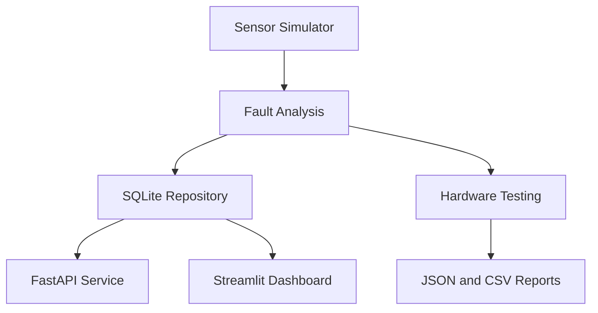

# Sensor Data Logging & Hardware Test Platform

[](https://github.com/AJooujee/Software_Engineering_Career_Projects/actions/workflows/sensor-platform-ci.yml)

A Python platform for generating simulated hardware sensor data, detecting faults,
storing measurements, automating hardware tests, and monitoring system health.

## Features

- Simulates temperature, voltage, current, and vibration sensors
- Generates repeatable readings using configurable random seeds
- Injects warning and fault conditions at configurable rates
- Classifies readings using sensor-specific thresholds
- Stores and retrieves readings with SQLite and SQLAlchemy
- Calculates health scores and status distributions
- Runs automated hardware pass/fail tests
- Exports hardware test reports to JSON and CSV
- Provides an interactive Streamlit and Plotly dashboard
- Provides a versioned FastAPI REST API with Swagger documentation
- Packages the API and dashboard with Docker Compose
- Runs automated tests and Docker builds with GitHub Actions

## Architecture



## Technology Stack

- Python 3.12
- FastAPI and Uvicorn
- Streamlit, Plotly, and Pandas
- SQLAlchemy and SQLite
- Pytest
- Docker and Docker Compose
- GitHub Actions

## Local Setup

```powershell
python -m venv .venv
.\.venv\Scripts\Activate.ps1

python -m pip install --upgrade pip
python -m pip install -r requirements.txt
python -m pip install -e .
```

## Sensor Simulation

Generate sensor readings:

```powershell
sensor-sim --count 5 --seed 42
```

Generate warnings and faults and save them to SQLite:

```powershell
sensor-sim --count 25 --warning-rate 0.1 --fault-rate 0.05 --database data/sensor_data.db
```

## Hardware Testing

Run automated hardware tests and generate JSON and CSV reports:

```powershell
sensor-test --count 10 --warning-rate 0.1 --fault-rate 0.1
```

## Dashboard

Start the interactive dashboard:

```powershell
sensor-dashboard
```

Open `http://127.0.0.1:8501`.

## REST API

Start the API locally:

```powershell
sensor-api --reload
```

Open Swagger documentation at `http://127.0.0.1:8000/docs`.

| Method | Endpoint | Purpose |
|---|---|---|
| GET | `/health` | Check API health |
| POST | `/api/v1/simulations` | Generate and store readings |
| GET | `/api/v1/readings` | Retrieve stored readings |
| GET | `/api/v1/summary` | Retrieve health metrics |
| POST | `/api/v1/hardware-tests` | Run hardware tests |

## Docker Deployment

Start the API and dashboard:

```powershell
docker compose up -d
docker compose ps
```

Generate data inside the shared Docker volume:

```powershell
docker compose exec api sensor-sim --count 25 --warning-rate 0.1 --fault-rate 0.05 --database data/sensor_data.db
```

Containerized applications:

- API documentation: `http://127.0.0.1:8001/docs`
- Dashboard: `http://127.0.0.1:8501`

Stop containers while preserving database data:

```powershell
docker compose down
```

## Automated Tests

Run the complete test suite:

```powershell
python -m pytest
```

The project currently contains 42 automated tests covering simulation,
fault analysis, persistence, reporting, dashboard processing, and API behavior.

## Continuous Integration

GitHub Actions automatically runs the test suite and builds the Docker image
whenever Project 3 changes are pushed or included in a pull request.